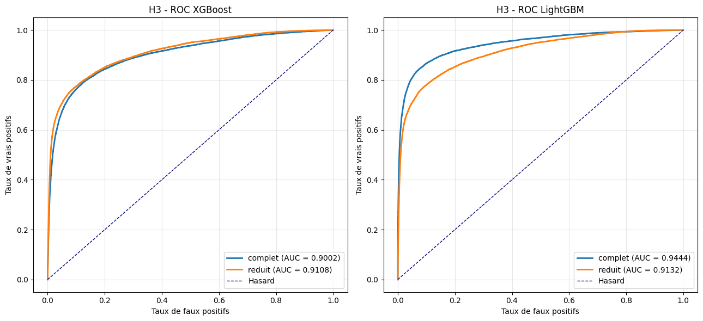
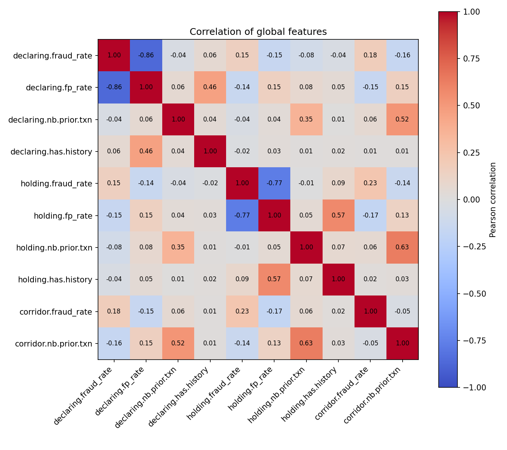
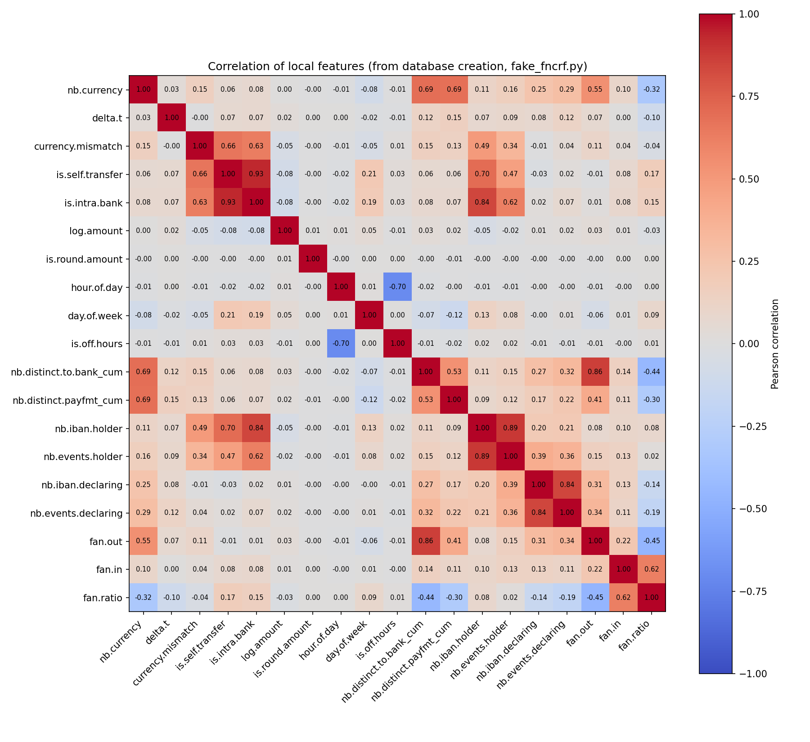

*This is a full English translation of the dissertation originally written in French*

\newpage

# I – General Introduction

## I.1 – Introduction

The fight against payment fraud in Europe has long faced a structural constraint: banking secrecy prohibits institutions from sharing IBANs identified as fraudulent among themselves, allowing repeat fraudsters to operate across multiple institutions without being detected. The Labaronne law (2025) lifts this constraint in France by creating the FNC-RF, a national file centralizing reports of fraudulent accounts between PSPs. This dissertation examines the scope of this centralization: does a machine-learning risk scoring model applied to a database of this type enable a robust stratification of repeat fraudsters from false positives, and do the inter-institutional signals it makes accessible empirically justify regulatory centralization against the alternative structurally favored by the literature, federated learning (FL).
In the absence of access to the real FNC-RF, a proxy database (Fake-RF) is constructed from the synthetic dataset created by IBM *AML World* [3], by simulating a per-bank reporting process combining a scoring model and investigation. Three hypotheses are tested: the robustness of stratification by supervised models (H1, logistic regression, Random Forest, XGBoost, LightGBM, MLP); the superiority of centralized training over simulated federated schemes (H2, FedAvg, FedAdam, FedAdam with differential privacy, Fed-XGBoost); and the predictive value of inter-institutional variables, assessed via SHAP (H3).
The results support H1, H2, and H3, albeit with reservations. All architectures discriminate between true and false positives with a ROC-AUC of 0.89 or higher, with overall accuracy ranging between 0.74 and 0.92, and between 0.63 and 0.83 on true positives (H1). Each federated variant shows a performance degradation relative to the equivalent centralized model (H2). This degradation is attributable in part to inter-institutional variables, which rank among the most important predictors according to SHAP, with a measurable effect on performance (H3). These results, obtained on a proxy database and therefore to be interpreted with caution, suggest that the FL performance loss is not solely a matter of convergence constraints, but reflects a structural loss of signal—an empirical argument in favor of regulatory centralization of anti-fraud intelligence at the European scale.

\newpage

## I.2 – Research question and hypotheses

We therefore outline the following research question:

*To what extent does a machine-learning risk scoring model, based on a classification between Fraudsters and False Positives and applied to a centralized regulatory database of the FNC-RF type, enable a robust distinction between repeat fraudsters and false positives, and do the inter-institutional signals it makes accessible empirically demonstrate the structural superiority of regulatory centralization over federated learning for European anti-fraud intelligence?*

From this research question the following hypotheses follow:

H1: Classification applied to a centralized fraud database robustly stratifies repeat fraudsters from false positives.

H2: Models trained on the entire centralized database show superior performance to models trained with various federated-learning algorithms, per PSP.

H3: Inter-institutional variables (number of reporting institutions, delay between reports, statistics on the reporting institutions and on the institutions where accounts are domiciled) are significant predictors of recidivism, and these signals are not equivalently reproducible under a federated-learning (FL) scheme — which would constitute the central empirical argument in favor of regulatory centralization.

To answer this research question, we structure our approach in four parts.

The first contextualizes our approach: we trace the evolution of payment fraud in Europe, highlighting in particular how recent advances in generative models (LLMs, MLLMs) have broadened fraudsters' arsenal, before examining the regulatory framework that responds to it and presenting the FNC-RF database as the central innovation of this system.

The second part offers a literature review structured around the five theoretical pillars of our approach: ML applied to risk classification across various domains (fraud, AML, credit risk, and probability of default); federated learning and its structural limitations; class-imbalance management in statistics and ML; and finally, model explainability and the interpretation of variable impact.

The third part details our methodology: the experimental protocols, the data, and the models chosen for each hypothesis.

The fourth and final part presents our results, confronts them with our three hypotheses, and discusses the limitations of our approach as well as the implications for designing a European anti-fraud intelligence infrastructure.

# II – Part 1: Context

## II.1 – The evolution of fraud in Europe

Simon Harris, the Irish Tánaiste and Minister for Finance, revealed in 2025 that his identity had been used to promote several fake investment funds, with the aim of extracting money from private individuals. The fraudsters had used deepfakes generated by generative AI models to imitate his voice and face with disturbing realism [40]. This episode illustrates a convergence between two structural dynamics: the continued growth of electronic payments and the democratization of generative artificial intelligence tools [24], which together are fueling a sustained rise in payment fraud in Europe.

### II.1.1 – Fraud on the rise in absolute terms

According to the joint EBA/ECB report on payment fraud published in 2025, the total amount of fraud in the European Economic Area reached €4.2 billion in 2024, compared to €3.5 billion in 2023 and €3.4 billion in 2022 — a 17% increase in one year [20]. This rise is mainly driven by two categories: fraudulent transfers (€2.5 billion, +24%) and card payments (€1.3 billion, +4%), which are precisely the typologies targeted by the FNC-RF database. It should nonetheless be qualified: this increase is more attributable to a rise in the value of fraudulent transactions than to an explosion in the number of fraudulent acts [20].

### II.1.2 – The turning point of social engineering

Many typologies of payment fraud coexist, from banking malware to fake SMS messages, including the physical interception of credentials. But the typology recording the strongest growth is manipulation. Fraudulent transfers initiated through manipulation of the payer rose from 65% to 74% in value, and from 55% to 71% in volume, between 2023 and 2024 [20]. The fraudster no longer circumvents the system; they attack the victim's judgment. This is referred to as social engineering and APP fraud.
While regulatory advances such as strong customer authentication (SCA) imposed by PSD2 have reduced certain forms of technical fraud, they have simultaneously pushed fraudsters toward less constrained vectors. The EPC identifies several rapidly growing typologies: impersonation of bank advisors, "secure account" fraud, tech support scams, and emergency or fund-recovery scams [21]. Generative AI amplifies all of these vectors — phishing, smishing, audio and video deepfakes — with a realism that transcends linguistic and cultural barriers [21]. The Simon Harris affair is a visible illustration of this [40].

### II.1.3 – The emergence of agentic payments: a frontier to monitor

Beyond current trends, one development deserves mention, even though it remains outside the direct scope of this dissertation: the rise of agentic payments. These systems delegate to autonomous AI agents the ability to initiate, validate, or manage transactions on behalf of a user [5]. The efficiency gains are theoretically real. Yet the means of compromise are numerous (contaminated training data, prompt injections, or leakage of personal data, for example). The implications for fraud are therefore profound: a compromised agent becomes a vector for large-scale fraudulent initiation, without any identifiable human intervention. Existing regulatory frameworks such as the SCA promoted by PSD2, which were designed around human payer consent, are not suited to this paradigm, and infrastructures such as the FNC-RF will need to anticipate it.

## II.2 – The regulatory context

This dissertation is situated within a specific European and French regulatory context: that of the Labaronne Law in France, but also the PSD and PSD2 payment regulations and the European anti-fraud VOP directive. We will examine these below in chronological order.

### II.2.1 – PSD / PSD2

Following the growth of electronic payments at the start of the twenty-first century, the European Union sought to regulate the payments space, first with the Payment Services Directive, PSD [14], in 2007. This directive laid the foundations for the rules applicable to *PSPs*, *Payment Service Providers*. Following the growth of online commerce, the emergence of Fintech, and the development of mobile payments, the Commission revised its framework by adopting the revised Payment Services Directive, PSD2 [15], in 2016, which required national transposition by 2018. The key objectives of PSD2 are aligned with the European Commission's traditional goals, namely promoting competition and protecting consumers. For PSD2, these translate into three areas: strengthening transaction security, increasing competition within the banking sector and among third parties, and harmonizing practices across the European area.

In terms of anti-fraud efforts, PSD2 establishes SCA, that is, strong authentication requiring dual validation of transactions. These developments have had a measurable impact on payment fraud in Europe. Indeed, fraud decreased by nearly 50% between 2020 and 2021 following its rollout [55]. Nevertheless, its regulations proved insufficient to combat so-called APP fraud through payment manipulation and more or less sophisticated social engineering, as discussed in section II.1.

A revision is underway, and the Commission is preparing PSD3, for which a provisional agreement was reached in November 2025 and whose full application is expected in 2027-2028. Among other things, it explicitly strengthens fraud detection requirements and introduces an expanded liability regime with spending limits, secure authentication, and reimbursement for impersonation fraud as described above.

### II.2.2 – VOP

The adoption of Regulation (EU) 2024/886 on Instant Payments (Instant Payments Regulation, IPR) [16], on 13 March 2024, marks a decisive step in securing European payments. This regulation requires all *PSPs* in the euro area to offer instant euro transfers 24/7, at a price equivalent to that of standard transfers, an obligation aimed at generalizing the use of real-time payments while managing the associated risks.
The regulation's flagship measure, applicable since 9 October 2025, is the Verification of Payee (VoP) obligation [23]. This mechanism requires PSPs to verify, before executing any SEPA transfer, that the beneficiary's name entered by the payer matches the name associated with the recipient IBAN. The result of this verification is communicated in the form of a status (match, close match, no match) before payment authorization.
The VoP architecture relies on an interoperable scheme defined by the European Payments Council (EPC) through its SEPA Verification of Payee Scheme Rulebook, which entered into force on 5 October 2025 (version 1.0) and was updated in March 2026 (version 1.1). In practice, the payer's bank sends a real-time request to the beneficiary's bank, which returns the matching result. VoP represents the first pan-European IBAN infrastructure explicitly designed to counter fraud and, as such, constitutes the direct precursor to the centralization mechanisms that would follow at the national level.

### II.2.3 – The Labaronne Law

Despite the progress brought by PSD2 and VoP, a structural gap persisted in the fight against transfer fraud: the legal impossibility for banking institutions to share information about suspicious accounts with one another. Banking secrecy, a fundamental principle of French law, prevented an IBAN identified as fraudulent by bank A from being reported to banks B, C, or D, which could therefore continue executing transfers to that account for several days, or even several weeks. Fraudsters were thus able to continue operating without necessarily needing to open new accounts.

This gap is documented by data from the Observatory for the Security of Payment Means (OSMP) of the Banque de France [11]: in the first half of 2025, manipulation fraud accounted for approximately €245 million in losses, or nearly 40% of all payment-method fraud. Furthermore, according to the explanatory memorandum of the initial bill, nearly 48% of bank transfer fraud in 2023 was linked to fake-IBAN scams [8], for a total loss of €149.76 million.

Bill No. 884 was ultimately adopted: Law No. 2025-1058 of 6 November 2025, known as the Labaronne Law after its rapporteur at the National Assembly, Daniel Labaronne, provides a direct response to this gap by creating an express exception to banking secrecy for the benefit of a new centralized mechanism: the National File of Bank Accounts Flagged for Fraud Risk (FNC-RF). Adopted by the National Assembly on 31 March 2025, then by the Senate on 29 October 2025 under the committee legislative procedure, the law establishes a daily reporting obligation for suspicious IBANs by all French PSPs and banking institutions. The terms for collecting, retaining, and consulting the data are defined by ministerial order, following the opinion of the National Commission for Information Technology and Civil Liberties (CNIL), in order to ensure the confidentiality and protection of data relating to individuals. We will examine the detailed operation of the FNC-RF database more specifically in the following chapter [35].
In sum, SCA, VoP, and FNC-RF form part of a trajectory toward securing payments at both the national and European levels, placing consumer protection at the heart of regulatory mechanisms. It should be noted, however, that this security logic entails, in return, a progressive reduction in transactional anonymity: each additional regulatory layer requires finer identification of payment actors, from names to IBANs, up to centralized suspicious behaviors. This tension between protection and privacy constitutes one of the structural challenges that any anti-fraud intelligence system will have to resolve.
It is precisely within this perspective that the FRIDA (Fraud Information Distribution Arrangement) project of the European Payments Council (EPC) [22] is situated. Anticipating the obligations of the future Payment Services Regulation (PSR), expected in 2028, the EPC has established a task force responsible for designing a scheme enabling PSPs to exchange fraud-related information according to common rules and standards across the entire SEPA area. In January 2026, the EPC launched a call for information to identify operators of a central FRIDA platform, marking the project's transition to a concrete operational phase. The French FNC-RF, viewed in this light, is not a national exception but a precedent: the empirical demonstration that regulatory centralization of anti-fraud intelligence is legally feasible and operationally viable. It is this thesis that the present dissertation intends to evaluate and substantiate from the empirical angle of classifying accounts between false positives — that is, accounts reported as fraudulent but subsequently cleared — and fraudsters, by comparing a decentralized system with a centralized system.

## II.3 – The FNC-RF database

As seen in chapter 2, the Centralized National File of Fraudulent Payment Accounts was created following the adoption of the Labaronne Law, based on a specific exception to banking secrecy allowing the pooling of fraudulent IBANs among PSPs.

### II.3.1 – Architecture and operation

These reports are centralized and consolidated by the Banque de France, which acts as a neutral operator and trusted third party. To this end, the Labaronne Law establishes an explicit exception to banking secrecy, a necessary condition for the legality of inter-institutional data sharing [35], with the mechanism placed under the supervision of the CNIL to ensure GDPR compliance. Once an IBAN is registered, connected PSPs can query it in real time to inform their customers of the risk associated with a transfer or, where appropriate, to block it preventively. In practice, PSPs are required to create a timestamped event for each fraud report, providing various characteristics: type and source of the fraud, originating channel, nature of the transaction, account identifiers, and event status. Each event is assigned a unique identifier (UUID), as well as publication, occurrence, and update dates. The only personal data used is the IBAN of the presumed fraudulent account, which serves solely as an identification key and can be encrypted to ensure GDPR compliance. These events serve as the basis for blocking IBANs. Nevertheless, a large number of events are false positives, that is, IBANs ultimately cleared after investigation. Indeed, only 23% of flagged IBANs are reportedly genuinely fraudulent as of this date [63].

We will refrain from further detailing the FNC-RF database. Indeed, not having had access to the data, we use the database created by IBM and their *AML World* generator [3].

\newpage

### II.3.2 – Positioning relative to the literature

The literature on inter-institutional fraud detection has largely favored federated learning (FL) as the solution to the fundamental problem of data sharing under confidentiality constraints [9, 28]. In this paradigm, each institution trains a local model on its own data, with only aggregated gradients or parameters being shared, thereby preserving the confidentiality of raw data. While this approach constitutes an elegant response to legal constraints, it structurally induces a loss of signal: inter-PSP relationships — for example, the same IBAN reported by several entities, or the time elapsed between two reports concerning a fraudster — are not observable under a federated scheme without complex and potentially noisy aggregation mechanisms.

# III – Part 2: Literature Review

Here we will present a literature review of ML applied to classification, and more specifically to risk classification. We will then focus more precisely on federated learning, the management of class imbalance, and model applicability, which is central to the experimentation presented in this dissertation.

## III.4 – ML applied to risk classification

### III.4.1 – Introduction

The detection and classification of financial risks constitute one of the oldest fields of application of statistical methods in general [19]. From the early work on credit scoring in the 1990s, through classical non-parametric methods such as *KNN* [17], to the deep learning architectures of the early 2000s [32], the literature has progressively refined its ability to identify abnormal patterns in massive and heterogeneous financial data. This chapter presents a structured overview of the approaches adopted in this dissertation, chosen for their completeness and relevance to the IBAN risk stratification problem posed by the FNC-RF, while preserving a degree of interpretability in order to be able to conduct an experimental approach.

More recently, this literature has diversified according to the application domains covered by *Machine Learning* (*ML*) for risk classification: credit card approval prediction combining ML and DL [50], adaptive credit scoring in digital lending [6], money laundering detection on mobile transactions via deep learning [25], or even internal risk management through adaptive scoring and LLM-assisted threat detection [30]. More specifically regarding payment fraud, alternative approaches such as deep reinforcement learning [51] or autoencoders [47] have also been explored in the literature, although they are not adopted in this dissertation.
It should be stressed from the outset that the problem addressed in this dissertation differs from classical fraud detection: the entire set of observations is already composed of IBANs flagged as fraudulent. The objective is therefore not to separate fraudulent from legitimate transactions, but to stratify risk within a homogeneously suspicious population by distinguishing systemic repeat offenders from false positives and isolated cases. We will begin with a simple review of the basic Machine Learning processes used in classification problems.

### III.4.2 – Logistic regression

Logistic regression, introduced by Cox [18], constitutes the natural starting point for any binary or multiclass classification task in a financial context. It models the probability of belonging to a class using a sigmoid function applied to a linear combination of the explanatory variables. Its interpretability is intrinsic — each coefficient is directly interpretable as a log-odds — which makes it a preferred reference model in regulatory and academic environments. It is defined as:

$$P(Y=1\mid X) = \frac{1}{1 + e^{-z}}$$
$$\ln\left(\frac{P}{1-P}\right) = \beta_0 + \beta_1 x_1 + \dots + \beta_n x_n$$

where $z = \beta_0 + \beta_1 x_1 + \dots + \beta_n x_n$.

In the context of IBAN risk scoring, logistic regression will serve as an interpretable baseline, allowing us to establish a reference performance level and to validate the relevance of the constructed features before introducing more complex models. Its limitations are well documented: it assumes a linear relationship between the features and the log-odds, which makes it unsuited to capturing non-linear interactions between variables [44]. Note that throughout this dissertation, when we refer to a "linear model" we mean logistic regression.

### III.4.3 – Gradient descent and ML fundamentals

When faced with a classification problem such as this one, solving the model amounts to seeking to minimize the chosen objective function, that is, the loss function (or cost function) that measures the discrepancy between the model's predictions and the actual labels. For a binary classification — the case of interest here on our Fake-RF dataset, where we distinguish fraudsters from false positives — the most commonly used loss is binary cross-entropy (or log-loss), directly linked to the negative log-likelihood of a probabilistic model:

$$L(\theta) = -\frac{1}{N}\sum_{i=1}^{N}\left[ y_i \log(\hat{y}_i) + (1-y_i)\log(1-\hat{y}_i) \right]$$

where $y_i \in \{0,1\}$ is the true label of observation i, $\hat{y}_i = f_\theta(x_i)$ is the probability predicted by the model parameterized by θ, and N is the number of observations. Unlike linear regression, whose coefficients are obtained via a closed-form analytical solution (normal equations), this function does not admit a closed-form solution for logistic regression owing to the non-linearity introduced by the sigmoid function; an iterative solution is therefore required. We use gradient descent, *Stochastic Gradient Descent* or *SGD*, particularly when the datasets are large. The model parameters are updated in the direction opposite to the gradient of the loss (here the *cross-entropy loss*), with the update controlled by the learning rate.

For a mini-batch $B_t$ of uniformly sampled observations:

$$ \hat{g}_t = \frac{1}{|B_t|} \sum_{i \in B_t} \nabla_\theta L_i(\theta_t) $$

$$ \theta_{t+1} = \theta_t - \eta \,\hat{g}_t $$

*SGD* stems from the foundational work of Robbins & Monro [62], which approximates the gradient over a random subset of B observations. The quantity B and the learning rate η thus become two hyperparameters, which are important for ensuring the model's convergence [56]. This brings us to the next section.

#### III.4.3.1 – Hyperparameters

Unlike model parameters, such as the weights and biases of a neural network or the leaf weights of a decision tree, which are learned during training, hyperparameters are the model's configuration parameters that are fixed before the learning process begins. They are not learned but directly govern how learning proceeds. Canonical examples include the learning rate, batch size, number of iterations or rounds (number of trees T for boosting methods [13][29]), maximum tree depth, L1/L2 regularization coefficients, as well as class weighting, introduced in section (III.6.2).
Among other things, they help manage the bias-variance problem. A learning rate that is too high causes the optimization to diverge. A tree depth that is too large favors overfitting, while one that is too small produces high bias. The quality of the final model therefore depends in part on the choice of these hyperparameters. As shown by Bergstra & Bengio [57], the search space is in practice high-dimensional and non-homogeneous, which makes its exploration difficult. In this dissertation, these hyperparameters are determined systematically via Bayesian optimization.

#### III.4.3.2 – Bayesian optimization

Bayesian optimization (BO) is an efficient algorithm for exploring the hyperparameter space in cases where evaluating the objective function is costly and where that function is treated as a black box, with no known analytical expression or available gradient [59]. It is particularly well suited to the problem at hand: the model's performance as a function of the hyperparameters can only be evaluated empirically, and each training run on the Fake-RF dataset requires computing power and time — two things we lack in this dissertation.

The principle rests on two components. On the one hand, a *surrogate model* is trained on the points already evaluated in order to model the posterior distribution of the objective function over the hyperparameter space. On the other hand, an acquisition function, such as Expected Improvement (EI) or the Upper Confidence Bound (UCB), drives the selection of the next point to evaluate by arbitrating between exploitation (i.e., searching near already promising areas) and exploration (i.e., visiting regions of high uncertainty instead) [58, 59]. This strategy makes it possible to find a good set of hyperparameters in a very small number of evaluations, typically on the order of a few dozen to a few hundred trials. Moreover, a functional implementation exists, *scikit-optimize* (*skopt*), compatible with the stack used in this dissertation.

The skopt package supports continuous, integer, and categorical spaces, as well as several substitution mechanisms (Gaussian process, the *TP Estimator* of Bergstra et al. [60], random forest trees), which is essential for exploring mixed spaces such as those of XGBoost and LightGBM (III.4.4) [61]. This is the tool used to tune each architecture in H1 (as well as the H2 meta-learner) over a fixed duration, in order to guarantee the comparability of results (see appendix VII.1).

### III.4.4 – Decision trees and boosting

#### III.4.4.1 – Decision trees and Random Forest

Introduced by Breiman (2001) [12], Random Forest is a *bagging*-based ensemble algorithm. It trains an ensemble of $B$ independent decision trees $\{T_b\}$ on bootstrap samples of the data. For a new observation $x$, the final prediction $\hat{y}$ is obtained by aggregation:

$$\hat{y} = \frac{1}{B}\sum_{b=1}^{B} T_b(x) \quad \text{(for regression)}$$
$$\hat{y} = \operatorname{mode}\{T_b(x)\} \quad \text{(for classification)}$$

This dual randomization over the data and over the variables reduces the variance of the final model without significantly increasing bias, making Random Forest naturally robust to overfitting.
In the context of the FNC-RF, this architecture offers a twofold interest. On the one hand, it constitutes a conceptual entry point to ensemble methods before introducing *boosting*. Its limitations relative to boosting methods — a lower capacity to correct bias, weaker performance on imbalanced data as in the FNC-RF dataset — nonetheless justify the progression toward XGBoost, LightGBM, and CatBoost [41].

#### III.4.4.2 – XGBoost

XGBoost (*Extreme Gradient Boosting*), introduced by Chen and Guestrin (2016) [13], represents a major advance in Gradient Boosting methods, particularly for tabular data. Its superiority rests on an optimized objective function, which combines a differentiable loss function L with a regularization term Ω to control model complexity:
$$\text{Obj}(\Theta) = \sum_i l(y_i, \hat{y}_i) + \sum_k \Omega(f_k)$$

where the regularization is defined as $\Omega(f) = \gamma T + \frac{1}{2}\lambda \|w\|^2$, with $T$ the number of leaves and $w$ the vector of leaf scores. This structure natively incorporates L1/L2 regularization, making it possible to prevent overfitting while efficiently handling missing values and computational parallelism. This architecture has been widely validated in risk scoring and fraud detection applications [44] thanks to its ability to model complex non-linear interactions between variables, coupled with enhanced interpretability via SHAP and high computational efficiency.

#### III.4.4.3 – LightGBM

LightGBM (Ke et al., 2017) [29] optimizes the *Gradient Boosting* process via two major algorithmic innovations that significantly improve computational efficiency on large datasets. First, *Gradient-based One-Side Sampling* (*GOSS*) selects instances for learning by keeping those with the largest gradients — assumed to contribute the most information for model convergence — while retaining a random subset of low-gradient instances to preserve the distribution. This technique reduces training complexity from O(n) to O(log n).
Second, *Exclusive Feature Bundling* (*EFB*) reduces dimensionality by grouping mutually exclusive features (whose values are rarely non-zero simultaneously) into a single "bundle," thereby lowering the cost of tree construction. These optimizations, combined with a leaf-wise growth approach (rather than the tree-wise approach used by XGBoost) aimed at minimizing global loss by splitting the leaf with the highest gain, enable fast convergence without loss of performance. In this dissertation, this computational efficiency — superior to that of XGBoost — constitutes a crucial asset for simulating multiple models in a Federated Learning environment.

### III.4.5 – Deep learning

#### III.4.5.1 – Fundamental concepts: neural networks

A *feed-forward* neural network (*FFN*) can be mathematically defined as a universal function approximator transforming an input x into an output y through a succession of stacked neuron layers. At each layer l, the network first performs a linear transformation of the activations from the previous layer:
$$z^{(l)} = W^{(l)} a^{(l-1)} + b^{(l)}$$

A non-linear activation function $\sigma$ is then applied to obtain the activations of the current layer, allowing the model to capture complex relationships; we choose ReLU in this dissertation:

$$a^{(l)} = \sigma\!\left(z^{(l)}\right)$$

with,

$$\sigma(x) =\max(0,x)$$

The forward pass process is defined by the following chain, starting from the input $a^{(0)} = x$:

$$a^{(l)} = \sigma\!\left(W^{(l)} a^{(l-1)} + b^{(l)}\right), \qquad \hat{y} = \sigma_{out}\!\left(W^{(L)} a^{(L-1)} + b^{(L)}\right)$$

Training the network consists of optimizing the weights $W$ and biases $b$ by minimizing a loss function $L(\hat{y}, y)$ via gradient descent algorithms and backpropagation of the error.

#### III.4.5.2 – FFN & MLP

As mentioned in section 4.1 with reference to the work of Rumelhart, Hinton, and Williams (1986) [45], feedforward neural networks constitute the foundation of deep learning applied to tabular data. Their ability to stack layers equipped with non-linear activation functions enables the learning of complex representations. Each successive layer transforms the data into an increasingly abstract hidden state, thereby enriching the model's predictive capacity. We incorporate these architectures in this dissertation to ensure an exhaustive test of hypothesis H1.
For this experiment, we deploy a *Multi-Layer Perceptron* (MLP) with a specific architecture including embedding layers, normalization, and *Gated MLP*-type blocks. The processing of categorical variables relies on *embeddings* [10]: each category is associated with a fixed-dimension vector (for example, 8) learned by the model. These vectors, once projected, are concatenated with the continuous variables to form the model's overall input vector, distinguishing fraudsters from false positives based on the normalized difference between the reporting of an event and its follow-up.
This input vector then passes through a *LayerNorm* layer [10], which applies per-sample zero-mean, unit-variance normalization, stabilizing training and preventing gradient degradation. The core of our architecture rests on *Gated MLP* blocks [46]: each block exploits a gating mechanism that linearly combines two distinct projections of the input vector, allowing for adaptive selection of signals before applying a ReLU activation function. Finally, a linear output head projects the learned representation into the class space, generating the logits needed to compute the probabilities.
More recent architectures based on *Transformers*, such as Tabformer [39] for modeling multivariate tabular time series or FraudTransformer [7] for time-aware transactional fraud detection, illustrate the field's recent evolution; however, they are not adopted in this dissertation, owing to their computational cost and the limited size of the per-bank subsets in Fake-RF.

### III.4.6 – Stacking and ensembles

Beyond individual models, *stacking* approaches — in which a meta-model is trained on the predictions of base models trained to predict the target on the training data — have demonstrated systematic performance gains on fraud detection tasks [2, 26]. The meta-model, typically a logistic regression or a lightweight XGBoost, learns to optimally weight the predictions of the base models according to their respective strengths and weaknesses, which strengthens regularization and de facto reduces overfitting, following a logic similar to that of a *Random Forest*, which, like stacking, offers the additional advantage of reducing the variance of predictions — a particularly relevant concern in the context of a database still undergoing maturation, where the risk of overfitting to non-generalizable patterns is not negligible. We will use it in the H2 tests with the architecture proposed by Zhang et al. (2024) [53].

### III.4.7 – Evaluation metrics

The choice of evaluation metrics is decisive in a context of asymmetric risk classification. Overall accuracy is a misleading metric when classes are imbalanced or when error costs are heterogeneous. The consequences of a wrongly blocked account are not the same as those of an account under investigation classified as low risk that subsequently reoffends.
The following evaluation methods are adopted to measure model performance:

**1. Precision and Recall**

Precision ($P$) measures the proportion of correct positive predictions:

$$P = \frac{VP}{VP + FP}$$

Recall ($R$, or sensitivity) measures the proportion of actual positive cases correctly identified:

$$R = \frac{VP}{VP + FN}$$

**2. F1-Score**

The F1-Score is the harmonic mean of precision and recall:

$$F1 = \frac{2 \cdot P \cdot R}{P + R}$$

**3. AUROC (*Area Under the Receiver Operating Characteristic*)**

AUROC evaluates the model's discriminative ability across all decision thresholds. The ROC curve plots the True Positive Rate (TPR) against the False Positive Rate (FPR):

$$TPR = \frac{VP}{VP + FN}, \qquad FPR = \frac{FP}{FP + VN}$$

AUROC corresponds to the area under this curve, where 0.5 indicates random classification and 1.0 indicates perfect separation.
Stratified k-fold cross-validation — that is, splitting the training data into 3 subsets, each with its own test data — accounts for the residual imbalance between the two classes and for temporal variance, in order to ensure a robust and representative model is built. It is applied uniformly across the three experimental conditions for training (H1, H2, H3) to guarantee the comparability of results.
Finally, the search for optimal hyperparameters via Bayesian optimization relies on the *predict proba* metric, that is, the model's average prediction confidence across the different classes.

## III.5 – Federated Learning

The introduction of federated learning (FL) by McMahan et al. (2017) [38], who formalize a training paradigm allowing several institutions to collaboratively build a global model without ever centralizing their training data. This framework addresses a structural constraint well documented in the literature: the tension between the need to aggregate distributed signals to improve model robustness and legal imperatives — banking secrecy, GDPR, data sovereignty — which stand in opposition to their centralization [52].

In the financial sector, each payment service provider (PSP) or banking institution holds reporting data specific to its own customer base, which is regulatorily protected and commercially sensitive. In the absence of a legal framework authorizing their pooling, FL constitutes, according to the literature, the reference solution for training collaborative inter-institutional models, notably for third parties who cannot aggregate their clients' data, while respecting these constraints. Awosika et al. (2024) [9] illustrate this use case by showing that an FL setup applied to financial fraud detection improves predictive performance compared to models trained in silos, while maintaining the confidentiality of each participant's data. This result constitutes the empirical starting point of this dissertation, insofar as it establishes the conditions under which FL represents an advance over the absence of inter-institutional cooperation, prior to the emergence of centralized databases such as FNC-RF or the future FRIDA. We present below two reference algorithms that we intend to test, as well as existing solutions to limit data leakage through the model's training gradients, as demonstrated by Zhu et al. [64].

### III.5.1 – FedAvg

The *Federated-Averaging* (*FedAvg*) algorithm of McMahan et al. (2017) [38] enables a viable implementation of federated learning. It operates through an iterative scheme of communication rounds coordinated by a central server: the server broadcasts the current global model to a random subset of clients.
Each client trains this model locally on its own data over several epochs with a given batch size, producing a local update.
The server aggregates the updates by weighted average according to each client's data volume:
$$w_{t+1} \leftarrow \sum_{k=1}^{K} \frac{n_k}{n} \, w_{t+1}^{k}$$

Where $w$ is the model weight, $K$ the number of clients, and $n$ the total number of data points.
McMahan et al. (2017) empirically demonstrate that FedAvg reduces communication costs while maintaining comparable performance on image classification tasks. Notably, the authors show that the algorithm remains robust to non-IID distributions, that is, to situations in which data distributions differ significantly between clients. This property is directly relevant in a multi-PSP context, where fraud profiles vary according to institutions and their respective client bases. However, Li et al. (2020) [33] strongly contest this notion, showing that final convergence toward the global minimum is biased by an error corresponding to the heterogeneity of the distributions of each client dataset. Indeed, intuitively, when each PSP trains its local model on its own fraud data, that model progressively converges toward the solution optimal for that specific PSP and not toward the global minimum. The more fraud profiles differ between PSPs, the more the local models diverge from one another, and the more their aggregation produces a degraded global model.

### III.5.2 – FedAdam

As seen in the previous paragraph, work following FedAvg has highlighted several convergence limitations in highly heterogeneous contexts, such as *client drift*.
In response, Reddi et al. (2020) [42] propose the general FedOpt framework, whose central idea is to distinguish what each client does locally (still SGD) from how the server aggregates the updates. In standard FedAvg, the server simply averages the received models, which amounts to applying SGD with a fixed learning rate of 1 across all parameters without distinction. FedOpt opens up the possibility of using a more sophisticated optimizer at the server aggregation level:
$$x_{t+1} = \text{ServerOpt}(x_t, -\Delta_t, \eta, t)$$

where $\Delta_t$ is the weighted average of the updates sent by each client, that is, the difference between the local model after training and the initial global model, rather than the raw gradients themselves.
FedAdam specializes this framework by replacing simple averaging with an Adam-type optimizer (*Adaptive Moment Estimation*) [65] on the server side. The practical difference is significant: whereas FedAvg applies the same learning rate to all model variables, FedAdam automatically adjusts this rate variable by variable according to the history of updates. A variable that receives strong and consistent updates across PSPs is assigned a lower rate, since it is already well integrated into the model's weights. Conversely, a rare but informative variable — for example, an infrequent but discriminating type of fraud such as a temporal gap between two events at two distinct banks — receives a higher rate, allowing it to be better captured despite its rarity. This is precisely the type of signal present in IBAN fraud data with an asymmetric distribution.
Reddi et al. (2020) [42] establish theoretically and empirically that this adaptivity significantly improves convergence on tasks with sparse gradients, and confers greater robustness to hyperparameter tuning. In the experimental framework of this dissertation, FedAdam is therefore the FL implementation adopted for the multi-PSP simulation (H2), owing to its documented superiority in heterogeneous non-IID contexts and its relevance to fraud cases located in the long tail of the distributions. Yet it has limitations, which theoretically reinforces H2. Indeed, according to FedAdam [34], first, the heterogeneous gradients received from each participant create instability in the aggregation of non-IID data. Second, the Adam optimizer's tendency to overfit local data during its update could reinforce client drift. At each communication with the server, the update of the estimates reduces the speed of convergence and could bias the global minimum obtained. This thesis is supported by a recent comparative study [37], which highlights that FedAdam has difficulty on more complex and heterogeneous datasets.

### III.5.3 – Federated XGBoost

The application of FL to tree-based models, and to XGBoost in particular, raises a fundamental algorithmic difficulty: unlike neural networks, XGBoost does not have continuous parameters that can be aggregated by weighted averaging. Direct application of FedAvg or FedAdam to a gradient boosting model is therefore structurally impossible, insofar as these algorithms operate on differentiable weight vectors, an assumption that tree ensembles do not satisfy.
Zhang et al. (2024) [53] document this constraint in the context of credit risk prediction under FL, adopting a distinct aggregation scheme for XGBoost. Independent trees are aggregated during the first round, and the aggregated tree is then sent back to the clients. For subsequent rounds, an ensemble is created by aggregating the predictions of this aggregated tree with a meta-learner (in their case a CNN that uses the predictions for each private dataset and becomes "learnable" using classical federated learning algorithms).
It should nonetheless be stressed that this scheme constitutes a federated paradigm structurally different from FedAdam applied to FNNs: FedAdam aggregates gradients and updates a single global model through adaptive optimization. However, FedXGBoost offers no correction for *client drift*. Zhang et al. (2024) [53] moreover observe that federated XGBoost models exhibit, on certain non-IID configurations, lower performance than the centralized model, whereas federated DL models tend to come closer to it. This distinction is explicitly documented in this dissertation rather than treated as equivalent, so as not to bias the experimental comparison during the H2 tests. Finally, we note that they record a 2 to 3% degradation compared to centralized models.

### III.5.4 – Federated learning and data protection

A structural limitation of FL is that the model updates themselves can reveal information about the local training data, via inference attacks or gradient reconstruction [64]. Abadi et al. (2016) [1] address this problem by introducing *differential privacy (DP)* applied to neural network training. The principle is to clip the gradient of each individual example and add calibrated Gaussian noise:
$$\tilde{g}_t \leftarrow \frac{1}{L}\sum_i \bar{g}_t(x_i) + \mathcal{N}\!\left(0,\, \sigma^2 C^2 I\right)$$

where $C$ is the clipping threshold and $\sigma$ the noise level. Abadi et al. formalize the guarantee obtained under the notion of $(\varepsilon, \delta)$-differential privacy: two adjacent databases (differing by a single example) produce output distributions that are statistically indistinguishable up to a factor $e^{\varepsilon}$, with probability $1-\delta$.
The introduction of DP noise represents an unavoidable trade-off: the stronger the privacy guarantee (low ε), the more the model's performance degrades. In the context of FL for financial fraud, this trade-off can be costly: fraud signals are rare and precise, and DP can mask exactly the discriminating patterns the model is trying to learn. Nevertheless, the authors highlight that they did not observe a significant loss of performance.

*See appendix (VII.3) for the detail of the algorithms tested here.*

## III.6 – Class imbalance management

### III.6.1 – A reversed structural imbalance

Unlike classical fraud detection problems where fraudulent cases represent a tiny minority of transactions, the FNC-RF dataset presents a reversed structure: the entire set of entries corresponds to IBANs already flagged as suspicious. The task is therefore a binary classification between confirmed fraudsters (repeat offenders or proven cases), who represent approximately 23% of the FNC-RF dataset and 15.93% of our Fake-RF dataset, and false positives.

This moderate imbalance nonetheless remains sufficient to bias models toward the majority class if left untreated, to the detriment of recall on false positives, whose correct identification is precisely one of the central objectives of this work.

### III.6.2 – Approaches adopted

Faced with this imbalance, two families of methods are generally used in the literature: resampling (SMOTE, undersampling) and class weighting. This work adopts class weighting exclusively, for the following reasons.

The algorithms adopted (XGBoost, LightGBM, Random Forest) natively incorporate weighting parameters, L1 and L2 regularizers, and other hyperparameters such as tree depth or the maximum weight assigned to each leaf, as well as the proportion of training data used by each tree, making it possible to penalize errors on the minority class more heavily without altering the data distribution. Synthetic resampling (SMOTE) introduces a risk of *data leakage* during cross-validation and generates artificial observations whose validity is questionable on real regulatory data. Given the theoretical structure of the FNC-RF dataset, with its 23% true positives, and that of the artificial dataset we are going to create, this imbalance remains moderate.

Weights are calculated inversely proportional to the frequency of each class:

$$w_c = \frac{N}{k \cdot N_c}$$

## III.7 – Explainability

### III.7.1 – Explainability challenges

The rise of ML in financial decision-making systems raises a fundamental tension: the more performant or complex a model is, the more opaque it tends to be. This opacity is problematic in a regulatory context where automated decisions affecting individuals' rights, such as blocking a wire transfer or flagging an IBAN, must be capable of being justified. Article 22 of the GDPR explicitly regulates automated decisions, while the European AI Act imposes increased transparency requirements for high-risk systems deployed in the financial sector. Explainability therefore conditions its operational and regulatory legitimacy. For an IBAN scoring system such as the one studied in this dissertation, a PSP that blocks a wire transfer must be able to justify the reason, not only to satisfy its legal obligations, but also to reduce customer disputes and the operational costs associated with false positives linked to a block. In this dissertation, it is necessary to verify hypothesis H3.

### III.7.2 – Overall review of XAI methods

Two major distinguishing characteristics of explainability methods can be identified: intrinsic vs. *post-hoc*, and local vs. global.
Indeed, some models are interpretable by construction, such as logistic regression, decision trees, or heuristic scoring rules. Others, such as XGBoost or neural networks, require explainability methods applied after training (post-hoc). In this dissertation, since the models adopted are predominantly *boosted* trees and *deep-learning* (DL) architectures, post-hoc methods are favored.
Furthermore, global explainability describes the model's overall behavior (which variables are globally important), whereas local explainability explains an individual prediction — why was this account considered a false positive, for example. Both levels are relevant: the global level to validate the model's consistency and support the argument for H3 in this dissertation, and the local level for operational PSP justification.

### III.7.3 – Normative framework for explainability

Beyond the choice of method, the quality of an explanation must itself be evaluated. Lago et al. (2025) [31] propose a framework structured around four criteria applicable to any XAI system:

- consistency: the explanation must remain stable under minor variations of the input;
- plausibility: the explanation must align with domain expert knowledge;
- fidelity: the explanation must faithfully reflect the model's internal mechanisms, not merely resemble them;
- usefulness: the explanation must be actionable for the end user.
Although developed in a medical context, this framework is directly transposable to fraud scoring. For a regulated entity using these models, an explanation is consistent if it is reproducible across two audits, plausible if the important features correspond to recognized fraud signals (reporting frequency, time to reoffend), faithful if it actually reflects the model's behavior (although this axiom is debatable, as we will see below), and useful if it enables the PSP to decide, with full knowledge of the facts, whether to block or release a wire transfer.

### III.7.4 – Review of the methods considered for this dissertation

#### III.7.4.1 – LIME

LIME (Local Interpretable Model-agnostic Explanations), introduced by Ribeiro, Singh & Guestrin (2016) [43], adopts a different approach: for each observation to be explained, LIME generates a set of local perturbations, trains a linear regression on these perturbations, and extracts the coefficients of this model as a proxy for feature importance.
The advantage of LIME is its generality: being model-agnostic, it applies to any architecture without access to gradients or the model's internal structure. It is also intuitive, producing explanations in the form of easily understandable linear weights. Nevertheless, it has several limitations: the algorithm is unstable. Indeed, the random sampling of perturbations means that two calls to LIME on the same observation can produce different explanations. Alvarez-Melis & Jaakkola (2018) [4] documented this instability and showed that LIME can produce contradictory explanations for similar observations, which is an unacceptable property in a research context but also in an audit context. The linear regression *surrogate* model is an approximation, and the quality of this approximation depends heavily on the chosen neighborhood. For complex non-linear models such as XGBoost on financial data, the local linear approximation can be misleading. Finally, the explanation is not globally coherent — LIME explanations do not aggregate coherently at the global level. It is therefore difficult to use LIME to draw conclusions about the relative importance of features across the dataset as a whole.

#### III.7.4.2 – SHAP

SHAP (*SHapley Additive exPlanations*), introduced by Lundberg & Lee (2017) [36], is based on Shapley values from game theory. For each prediction, SHAP decomposes the contribution of each feature additively:

$$f(x) = \phi_0 + \sum_i \phi_i$$

where $\phi_0$ is the model's average prediction and $\phi_i$ the marginal contribution of feature $i$, computed by averaging its impact across all possible feature coalitions.

This additive property gives SHAP two decisive advantages over competing methods: it is deterministic — for a given model and observation, SHAP values are unique and reproducible. Unlike LIME, which relies on random sampling of local perturbations, SHAP produces explanations that are stable from one run to another. In a regulatory audit context, this reproducibility is essential. Moreover, the sum of SHAP contributions is exactly equal to the difference between the prediction and the model's base value. This completeness property guarantees that no contribution is arbitrarily ignored or overestimated. Finally, SHAP satisfies three important formal properties: efficiency (sum of contributions = net prediction), symmetry (identical features receive identical contributions), and nullity (a variable with no impact receives a zero contribution). These properties make SHAP the theoretically most well-founded method for *post-hoc* importance attribution.

#### III.7.4.3 – Limitations

SHAP nonetheless has important limitations. Slack et al. (2020) [48] indeed demonstrate that these limitations concern in particular auditability and bias concealment. *Post-hoc* perturbation-based methods, including SHAP, are vulnerable to targeted adversarial attacks. By constructing a classifier, a malicious actor can design a model whose predictions on real data remain biased (for example, discriminating on a protected attribute), but whose SHAP explanations generated on perturbed data appear perfectly innocuous. This property exploits the fact that the perturbations SHAP uses to estimate contributions are often out of distribution. In experiments conducted on criminal recidivism (COMPAS) and credit scoring datasets, the authors show that a classifier discriminating solely on race can have its bias entirely masked by SHAP in 84% of cases. LIME proves even more vulnerable, with the bias masked in 100% of cases on the same dataset. Moreover, this method is computationally expensive; thus, for H3, we will use only XGBoost and LightGBM to test this hypothesis, as these models allow us to assign a place to inter-institutional variables in their predictions.

# IV – Part 3: Methodology

Hypotheses H1-H3 are formulated with a view to application on the FNC-RF database. In the absence of access to it before the writing deadline, they will therefore be tested on the proxy database Fake-RF, whose construction we will explain in detail in the following section, with the following adaptations: H1 and H2 tested as is, and H3 treated as an exploratory version, its inter-PSP variables being approximated by inter-bank variables derived from the IBM Transactions for Anti Money Laundering dataset [3]. The results are interpreted in light of this constraint, discussed in section IV. Finally, we will use a binary classification (0,1) for false positives and true positives respectively, since IBM's AML database does not allow the creation of a three-class stratification as we had originally intended.

## IV.8 – Data

### IV.8.1 – Fake-FNCRF & IBM Transactions for Anti Money Laundering

The data come from the IBM AML database created in 2022 [3]. This database was built using the AMLworld generator, developed jointly by IBM Research and ETH Zurich to create realistic synthetic financial transaction datasets for the development and benchmarking of anti-money-laundering (AML) detection models. This methodological choice addresses a structural constraint of the field: real financial data suitable for training money-laundering detection models are generally unavailable, and previous synthetic generators had significant shortcomings, notably the absence of realistic multi-institutional modeling.

The basic idea of AMLWorld is to create a multi-agent simulation, with a virtual financial world composed of individuals, businesses, and banks interacting, blending legitimate and criminal activity. The underlying model does not rely on the anonymization or obfuscation of real data, but on virtual individuals who recreate observed statistical distributions and patterns. This world features both benevolent and malicious agents, the latter engaging in criminal activities that require the laundering of illicitly obtained funds. The simulator represents the classic money-laundering flow: placement, *layering*, and integration into the legal economy. The generator thus creates complete laundering traces based on eight common laundering typologies (see Figure 1) by propagating a laundering label along transaction chains in order to provide a complete ground-truth label, an approach also used in earlier simulators such as *AML Sim* [49].

![*Money-laundering flow, source [4]*](patterns.png)

The generator thus made it possible to generate 6 different datasets. These six variants are organized along two axes: an illicit-activity rate (HI, high rate; LI, low rate) and a size (Small, Medium, Large), with volumes ranging from 515,088 accounts and 5,078,345 transactions for HI-Small to 2,116,168 accounts and 179,702,229 transactions for HI-Large.
Each transaction is described by: a timestamp, the sending bank and account identifiers, the receiving bank and account identifiers, the amount received and its currency, the amount paid and its currency, the payment format, as well as a binary label indicating whether or not it is a laundering transaction. It is the joint presence of the sending and receiving bank identifiers that allows, within the framework of this dissertation, the segmentation by institution necessary to construct Fake-RF. This data has been used extensively: the paper has been cited 235 times according to arXiv.

### IV.8.2 – Construction of Fake-RF

Faced with the institutional slowness of access to FNC-RF, and having a synthetic dataset rich in multi-institutional structure (IBM AML), we designed the following algorithm in order to build a database approximating the targeted regulatory process. We assume that each bank is required to report the transactions and accounts it considers to be involved in money laundering, and that this reporting results from an internal control system combining a scoring model and an investigation leading to the reporting of confirmed laundering cases after investigation, as well as a proportion of false positives detected by internal controls but subsequently disproved.

#### IV.8.2.1 – Modeling by bank

Transactions are grouped by sending bank (*From Bank*). Only banks with at least 30 labeled laundering cases are retained, this threshold guaranteeing a minimum volume for training a model per institution.

For each account, a set of variables is computed in a strictly causal manner (using only the history available at the time of the transaction, in order to avoid any information leakage): time elapsed since the previous transaction, currency mismatch between sending and receiving, an indicator of intra-bank or self-transfer, transformed amount (log, round-amount indicator), time variables (hour, day of week, off-hours transaction), as well as the cumulative diversity of counterparties, banks, and payment formats encountered up to the current transaction. To these account-level variables are added aggregated statistics per sending bank and per receiving bank (dominant currency, number of distinct accounts and events), as well as indicators of the account's connectivity in the transaction graph (*fan-in*, *fan-out*, ratio of the two, for example).

In order to avoid any temporal information leakage and to reproduce a realistic detection scenario (training on history, detection on future transactions), the train/test split is performed by temporal quantile: the 80% oldest transactions constitute the training set, and the 20% most recent constitute the test set.

For each retained bank, a logistic regression model (with balanced class weighting) is trained on the features described above. The extreme imbalance of the positive class (laundering) makes a standard decision threshold (0.5) unworkable. The threshold is therefore calibrated via the precision-recall curve on the training set, targeting a precision of 0.08, a choice made to guarantee an exploitable volume of false positives without generating excessive noise, with a fallback value of 0.15 if the target is not reached. This threshold was tested on the Medium HI dataset and then extended to Large HI, with its 180M transactions, 2.1M bank accounts, and a fraud rate of 1/807.

#### IV.8.2.2 – Class extraction and aggregation

On each bank's test set, all confirmed laundering cases are retained and labeled Fraudster; legitimate transactions classified as positive by the model at the calibrated threshold are labeled False Positive. The Fraudster and False Positive subsets for each bank, together with their institution identifier, are concatenated to form the Fake-RF database, used for all the experiments presented in Part IV.

### IV.8.3 – Statistical characteristics of the database

After processing by the procedure described above, we extracted a database made up of 1,636 banks, with varied true-positive rates. The table below shows an excerpt.

| Bank Code | False Positive | Fraudster | False Positive / Fraudster Ratio |
|---|---|---|---|
| 138848 | 891 | 7 | 127.285714 |
| 76077 | 317 | 3 | 105.666667 |
| 63576 | 187 | 2 | 93.500000 |
| 211154 | 1441 | 17 | 84.764706 |
| 39382 | 324 | 4 | 81.000000 |
| 125437 | 235 | 3 | 78.333333 |
| 147527 | 221 | 3 | 73.666667 |
| 18526 | 1529 | 21 | 72.809524 |
| 214853 | 1310 | 18 | 72.777778 |
| 40692 | 280 | 4 | 70.000000 |
| 130596 | 276 | 4 | 69.000000 |
| 247191 | 318 | 5 | 63.600000 |
| 44188 | 179 | 3 | 59.666667 |
| 196461 | 848 | 15 | 56.533333 |
| 34562 | 1053 | 19 | 55.421053 |

*Table 1 – False positive rate for the first 50 banks in the database and fraudsters per bank in Fake-RF*

We first create a training and validation dataset. Since our data is temporally sensitive, we created the following protocol.

Given the intrinsically temporal nature of the transactions, a k-fold validation with k=5, of approximately 15 days each, proves methodologically necessary. In order to preserve the causal integrity of the experiment, we adopt a rolling-window cross-validation protocol. The characteristics of each segment are as follows:

| Segment | True Positives in % *Train* | True Positives in % Val |
|---|---|---|
| 1 | 0.0642 | 0.1048 |
| 2 | 0.0769 | 0.8850 |
| 3 | 0.0897 | 0.9482 |
| 4 | 0.0940 | 0.9482 |
| 5 | 0.0952 | 0.9174 |

*Table 2 – Characteristics of the rolling-window cross-validation segments*

We observe an increase in fraud rates toward the end of segments, which is a known bias in our database. The authors of [3] explain this bias by the fact that more transactions are flagged *post hoc*: "Note that the "Date Range" provided is "primary" period of transaction activity. In the discussion Marco Pianta observed that there are some transactions after the specified date period, and that those transactions are all laundering. Please see the response to Marco for a fuller description of this situation and how to deal with it. We thank Marco for raising this issue." Hence the need to resort to k-fold validation, whose robustness is further reinforced by the fact that, as presented in the introduction, fraud patterns are changing.

For a final fraud proportion for Train and Val of:

| | True Positives | False Positives |
|---|---|---|
| Train | 0.0854 | 0.9145 |
| Val | 0.1593 | 0.8404 |

*Table 4 – Final fraud proportion in Train and Validation*

The validation data is therefore structurally close to the real FNC-RF database with its estimated 23% true positives.

This protocol segments the temporal continuum of the data into n successive segments. At each iteration, the model is trained on a growing historical window and evaluated on an immediately following future validation window. To ensure strict independence between the training and test sets and thus avoid any contamination by immediate temporal dependencies, we introduce a one-hour guard interval between the end of the training period and the beginning of the validation period.

We then carried out exploratory tests on the database to see whether temporal structures — for example, arranging the data as an event matrix, i.e., n_transactions × (n features) per account, with the objective of predicting whether the last event is fraud — made a difference. This did not prove conclusive and thus justified our choice to exclude certain architectures such as LSTM [27] or CNN from this dissertation. Our models therefore use the data as a per-transaction vector composed of n variables. See details in the appendix (VII.2).

## IV.9 – Experimental structure

This chapter details the experimental protocol implemented for each of the three hypotheses, based on Fake-RF (cf. IV.8.2). Each section specifies the model used, the evaluation procedure, and the limitations specific to the protocol.

### IV.9.1 – H1: Robustness of the stratification

Objective. To verify whether a supervised classifier trained on Fake-RF succeeds in robustly discriminating the Fraudster class from the False Positive class.

#### IV.9.1.1 – Protocol

A model is trained on the aggregated Fake-RF set (all banks combined), with hyperparameter optimization via Bayesian optimization validated by 3-fold cross-validation to ensure the presence of true positives in all test and training folds. The Bayesian optimization algorithm thus seeks to minimize the AP score in the hyperparameter space, with one hour per model. The best model is then evaluated and compared.

Details of the created *features* are described under H3 and in the appendix. We proceed in the standard way with scaling and encoding of features (see appendix VII.2.1): numeric variables are centered and scaled, and categorical variables are encoded.

#### IV.9.1.2 – H1 validation criterion

H1 is considered supported if the calibrated (*tuned*) model robustly distinguishes FPs from fraud cases, and outperforms a baseline model such as logistic regression. An intrinsic limitation is that the measured signal is partly circular: the false positives themselves come from a per-bank logistic regression model (IV.8.2.1). An H1 model of the same family (logistic regression) therefore risks artificially over-performing by re-learning the decision boundary used to generate the labels. This bias is discussed in IV.4 and motivates the choice, for H1, to test different models in order to verify that the signal generalizes beyond the logistic regressions used to create the dataset.

### IV.9.2 – H2: Centralization vs. Federated Learning

Objective. To compare the performance of a model trained on the centralized Fake-RF set with that of models trained under a federated learning scheme, where each bank constitutes a client.

#### IV.9.2.1 – Protocol

The federated scheme is approximated by FedAvg, FedAdam, FedAdam + DP, and Fed-XGBoost, with each Fake-RF bank treated as a local client with its own data. At each round, clients train locally and then transmit their updates, which are aggregated by the server according to the server-side Adam rule. This simulation remains simplified: it models neither network latency nor real communication constraints. Nevertheless, it does properly incorporate the constraints related to DP. Categories are encoded at the global (i.e., server) database level, but numerical data are normalized per bank. The database is then segmented by bank and the algorithms described in III.5 are implemented.

More specifically, we will run the experiment with: an MLP for FedAdam, FedAvg, and FedAdam with DP, using exactly the same architecture as for H1 in order to ensure a fair comparison between models. As well as with XGBoost coupled with a Linear Meta-Learner with a projection into the two-class space, for the implementation of the methodology of Zhang et al. (2024) [53]. Unlike them, we did not use a CNN. It added a high computational cost for similar results after ablation on a subset of the dataset. This experiment is carried out on the 1,636 banks and their transactions, and due to the nature of the aggregation, it is relatively slower than training on the whole database. Note that, due to the smaller sample sizes, we train noticeably smaller trees per client than on the centralized database, and untuned, with a single boosting round for resource reasons. In order to test their algorithm more robustly, we will test the following procedure:

the same algorithm as with XGBoost but with a LightGBM of a single round, tuned, as well as with 100 rounds instead of 50, and a *Meta-Learner* (see appendix for details in VII.1.2), in order to have a fairer comparison for Fed-XGBoost and federated boosting methods.

#### IV.9.2.2 – Validation criterion

H2 is supported if the centralized model outperforms, on the same metrics as in 9.1, the best federated model obtained after convergence of the chosen algorithms. Note that we will use exactly the same architecture for the MLP as for the centralized model in order to guarantee a fair comparison between models.

Limitation. The number of communication rounds and the convergence of FedAdam are bounded by the available computational resources, particularly for Fed-XGBoost, where we use models with only a single boosting round, which strongly limits the quality of per-client predictions. Non-convergence of the federated model should not be wrongly interpreted as a structural inferiority of FL, but should be documented as a computational limitation of the experimental protocol, a distinction explicitly discussed in IV.4. Moreover, these models do not benefit from the same inter-institutional *features*. At this level, we apply the same protocol as when building the database. Hence the need to test H3.

### IV.9.3 – H3: Predictive value of inter-institutional signals

#### IV.9.3.1 – Objective

To test whether inter-PSP variables (number of reporting banks, inter-reporting delay, statistics per reporting bank) are significant predictors of recidivism, and whether their reproduction is equivalent under centralized and federated schemes.

#### IV.9.3.2 – Protocol

The inter-institutional variables are constructed from the bank identifiers available in Fake-RF. We compare the performance of the different models on the dataset with and without inter-institutional variables. Predictive importance is assessed using SHAP. We also conduct a comparison of these variables under FL and centralized settings. See the appendix for details on the variables (VII.3).

We note a structural limitation parallel to that of FNC-RF. Fake-RF is composed only of the Fraud and False Positive subsets extracted from each bank's test set (IV.8.2.2), and not of the complete account history. It is therefore impossible to compute connectivity patterns (*fan-in/fan-out*, transaction chains) over the entirety of the underlying transactional graph. Only the transactions retained in the extraction are visible. This limitation is not a mere artifact of our protocol: it faithfully reproduces a real constraint of FNC-RF itself, which centralizes only the cases reported by PSPs and not the full set of transactions in the payment system.

#### IV.9.3.3 – Validation criterion

H3 is partially supported if the inter-institutional variables emerge as significant predictors under the centralized model, and their reconstruction proves degraded or impossible under the simulated federated scheme in 9.2 (local bank updates cannot, by construction, access third-party bank identifiers). This hypothesis is treated as exploratory, its validation resting on a proxy dataset rather than on the target regulatory database.

\newpage

# V – Part 4: Results

## V.10 – H1: Performance on the centralized database

After tuning each architecture on the centralized database for one hour, we obtain the following results:

| Model | Threshold | Precision on TP | Recall on TP | F1 on TP | Overall precision | ROC-AUC |
|---|---|---|---|---|---|---|
| MLP | 0.50 | 0.65 | 0.76 | 0.70 | 0.86 | 0.907 |
| MLP | 0.836 (tuned) | 0.75 | 0.78 | 0.76 | 0.91 | 0.919 |
| Random Forest | 0.50 | 0.62 | 0.79 | 0.70 | 0.85 | 0.897 |
| LightGBM | 0.50 | 0.83 | 0.80 | 0.81 | 0.92 | 0.944 |
| XGBoost | 0.50 | 0.74 | 0.73 | 0.74 | 0.89 | 0.903 |
| Logistic Regression | 50 | 0.25 | 0.98 | 0.4 | 0.36 | 0.871 |

*Table 5 – Performance of the architectures on the centralized database (H1)*

The results obtained convincingly validate hypothesis H1. All the models tested — FNN, Random Forest, LightGBM and XGBoost — achieve a ROC-AUC between 0.897 and 0.944 and outperform logistic regression. This indicates a discriminative capacity clearly above chance between the Repeat Offender class and the False Positive class. The convergence of these performances across architectures as different as a neural network and tree-based ensemble methods strengthens the robustness of this finding: the discriminant signal present in the data stratified via Fake-RF is not an artifact specific to a particular model, but reflects genuine separability between the two classes. Operationally, LightGBM stands out clearly from the other models, with the best ROC-AUC (0.944) and the best precision/recall trade-off already at the default threshold (F1 = 0.81, precision = 0.83, recall = 0.80), while XGBoost, although from the same boosting family, remains close to Random Forest's performance (F1 = 0.74). The MLP, for its part, requires an adjustment of the decision threshold to reach a level of performance comparable to or better than XGBoost, which suggests correct discriminative power but a less optimal native calibration. The relatively moderate precision observed for the Fraudster class for most models (0.62 to 0.75, excluding LightGBM) nonetheless indicates that the separation between the two classes, although statistically robust, remains imperfect in practice for these models, leaving a residual zone of confusion between fraudsters and false positives. We note that LightGBM's superior performance may be due to the fact that, being very fast, it could be tuned more efficiently by the BO algorithm during the 1 hour of allotted computation, and thus benefit from better hyperparameters — one of the strengths of this architecture.

H1 having been established, we can now move on to H2.

## V.11 – H2: Performance of simulated Federated Learning

After implementing the protocol presented previously, we obtain the following results:

| Model | Threshold | Precision on TP | Recall on TP | F1 on TP | Accuracy | ROC-AUC |
|---|---|---|---|---|---|---|
| MLP (centralized + Full) | 0.50 | 0.65 | 0.76 | 0.70 | 0.86 | 0.911 |
| LightGBM (centralized + Full) | 0.50 | 0.83 | 0.80 | 0.81 | 0.92 | 0.944 |
| FedAvg | 0.50 | 0.26 | 0.69 | 0.38 | 0.76 | 0.807 |
| FedAdam | 0.50 | 0.23 | 0.88 | 0.36 | 0.68 | 0.896 |
| FedAdam + DP | 0.50 | 0.23 | 0.88 | 0.36 | 0.68 | 0.893 |
| Fed-XGBoost + Meta-Learner | 0.50 | 0.52 | 0.44 | 0.48 | 0.90 | 0.830 |
| Fed-LightGBM + Meta-Learner | 0.50 | 0.68 | 0.16 | 0.26 | 0.90| 0.789 |

*Table 6 – Performance of federated methods compared to centralized models (H2)*

Comparing first the centralized MLP with access to inter-institutional variables to the federated variants relying on the same architecture (FedAvg, FedAdam, FedAdam+DP), we observe a systematic degradation of F1: the centralized MLP reaches 0.70, versus 0.38 for FedAvg and only 0.36 for FedAdam and FedAdam+DP. FedAvg retains the *accuracy* closest to the centralized model (0.76 vs 0.86) but at the cost of limited recall (0.69) and low precision (0.26). FedAdam, conversely, obtains a ROC-AUC close to the centralized model (0.896 vs 0.907) and higher recall (0.88 vs 0.76), but at the cost of severely degraded precision (0.23) and reduced *accuracy* (0.68). The addition of DP (FedAdam+DP) does not change this trend and confirms the stability of the trade-off and of the algorithm proposed by Abadi et al. (2016) [1]. Thus, for equal architecture, the centralized MLP retains a better precision/recall balance (highest F1) and better *accuracy* than all the federated variants, even though FedAdam surpasses it on recall alone. Note that all models were evaluated with a decision threshold of 0.5.

Broadening the comparison to the best centralized model with access to inter-institutional variables, across all architectures (LightGBM, F1 = 0.81, ROC-AUC = 0.944), the gap with the best federated model (Fed-XGBoost + Meta-Learner, F1 = 0.48, ROC-AUC = 0.830) widens further still, confirming that the federation constraint substantially degrades performance relative to the centralized baseline, even without the communication issues associated with DL and *boosting* approaches. H2 is therefore supported. The question now is whether to attribute this performance degradation to FL itself or to the loss of inter-institutional signals. We nonetheless qualify LightGBM's performance in this comparison, as it benefited from the best hyperparameters.

## V.12 – H3: Impact of centralized and inter-PSP features

After constructing the *features*, detailed in the appendix, as well as the databases combining both the inter-institutional signals and the statistics computed over the entire database, we obtain the following results:

| Model | Threshold | Accuracy | ROC-AUC | Precision on TP | Recall on TP | F1 on TP |
|---|---|---|---|---|---|---|
| XGBoost Full | 0.5 | 0.88 | 0.90 | 0.74 | 0.73 | 0.74 |
| XGBoost Reduced | 0.5 | 0.87 | 0.91 | 0.67 | 0.78 | 0.72 |
| LightGBM Full | 0.5 | 0.92 | 0.94 | 0.83 | 0.80 | 0.81 |
| LightGBM Reduced | 0.5 | 0.86 | 0.91 | 0.81 | 0.64 | 0.71 |
| MLP Full | 0.83 *(tuned)* | 0.91 | 0.91 | 0.75 | 0.78 | 0.76 |
| MLP Reduced | 0.83 *(tuned)* | 0.89 | 0.90 | 0.75 | 0.75 | 0.75 |

*Table 7 – Performance of the XGBoost, LightGBM and MLP models (Full and Reduced variants) on H3.*

Here, "Reduced" refers to models that do not benefit from the inter-institutional variables. We observe a clear delta for LightGBM between the Full and Reduced variants: +3% on ROC-AUC for the complete model relative to the incomplete one, +2% on fraud precision, +6% on overall precision, +16% on recall, and thus +10% on F1. However, the gains are less pronounced for XGBoost, potentially because it is less well tuned. We observe -1% on ROC-AUC, +7% on fraud detection, +1% on overall precision. Recall is worse (-5%) and thus there is a modest gain on F1 of +2%. Meanwhile, for the tuned MLP the performance loss is minimal.
The results partially point toward H3, even though the gains appear to be partly linked to architectural choices and to tuning for performance. Figure 1 below illustrates this result:

\newpage

Now, the second part of H3 concerns the use of inter-institutional features by the models. We examine the explanatory variables aggregated via SHAP for the complete models. For XGBoost, we obtain:

| Top 15 explanatory variables| Inter-institutional variable |
|---|---|
| Fan-out associated with the account | False |
| Reporting bank / bank originating the transaction | False |
| Another bank has reported this account as fraudulent for the transaction | True |
| Transaction amount (log, normalized) | False |
| Payment format | False |
| Bank receiving the transaction | False |
| Corridor fraud rate | True |
| Number of accounts reported in the database for the receiving bank | True |
| Number of currencies used by the account in the database | False |
| Time delta (log, normalized) since the last transaction in the database | False |
| Number of transactions reported for the reporting bank | True |
| Fan-out rate associated with the account | True |
| Number of transactions reported for the receiving bank | True |
| Transaction currency | False |
| Time of day of the transaction | False |

*Table 8 – Top 15 explanatory variables (SHAP) of the XGBoost Full model on H3.*

Thus, 6 of the most important *features* originate from inter-institutional variables.

\newpage

For LightGBM, the table is as follows:

| Top 15 explanatory variables | Inter-institutional variable |
|---|---|
| Fan-out associated with the account | False |
| Transaction amount (log, normalized) | False |
| Payment format | False |
| Reporting bank / bank originating the transaction | False |
| Corridor fraud rate | True |
| Bank receiving the transaction | False |
| Number of currencies used by the account in the database | True |
| Another bank has reported this account as fraudulent for the transaction | True |
| Time delta (log, normalized) since the last transaction in the database | True |
| Day of the week of the transaction | False |
| Fan-out rate associated with the account | True |
| Time of day of the transaction | False |
| Number of accounts reported in the database for the receiving bank | True |
| Number of transactions reported for the receiving bank | True |
| Number of accounts reported for the reporting bank | True |

*Table 9 – Top 15 explanatory variables (SHAP) of the LightGBM Full model on H3.*

8 of the most important variables for LightGBM are inter-institutional. Since this model is the best performing, this validates our hypothesis regarding inter-institutional variables. Finally, when we take a closer look at some of these inter-institutional variables, we find an explanation for the importance of the inter-institutional features. First, the histories of the receiving banks — that is, of the money laundering committed toward them — are visible per client in only 85.67% of cases. Second, the variable indicating that an account was reported as confirmed fraudulent at t-1 (9.34% of cases) has a fraud rate 6 times higher than the others, which explains its importance among the models' explanatory variables. We therefore consider that the inter-institutional features are of interest for classifying recidivism risk and that H3 is partially supported, but that the gains are heterogeneous across architectures.

\newpage

# VI – Conclusion

This dissertation examined the capacity of a risk-scoring model to stratify repeat fraudsters and false positives within a centralized regulatory database, and sought to establish whether the inter-institutional signals it makes accessible empirically justify centralization over federated learning. All three hypotheses are supported, but to unequal degrees of robustness.

The ability of ML algorithms to stratify true and false positives is validated (H1) unambiguously: all the architectures tested (MLP, Random Forest, XGBoost, LightGBM) discriminate between the two classes with a ROC-AUC above 0.89. This convergence across such different model families makes the result robust, largely independent of the architectural choice. The degradation in performance of FL algorithms is also supported (H2): for equal architecture, each federated variant (FedAvg, FedAdam, FedAdam+DP, Fed-XGBoost) systematically degrades relative to its centralized equivalent. One caveat is nonetheless warranted: most of the gap, when comparing the best models across all architectures, comes from LightGBM, which benefited from more efficient Bayesian tuning owing to its fast training time. However, in the context of limited computing resources (an M3 chip with 16 GB of RAM), this algorithm's performance and the importance of Bayesian tuning are results not to be overlooked. Part of the centralized/federated gap is therefore likely attributable to this tuning imbalance, not solely to the federation constraint. The comparison at equal architecture (centralized MLP vs. FedAvg/FedAdam), which is less exposed to this bias, is nonetheless also in favor of H2, even though the performance loss is smaller. The importance of inter-institutional features is only partially supported (H3). The inter-institutional variables are indeed among the most important predictors according to SHAP (6 of the top 15 for XGBoost, 8 for LightGBM), and removing them costs up to 10 points of F1 for LightGBM. But the gain is heterogeneous: marginal for XGBoost, nearly nil for the tuned MLP. The measured contribution therefore depends as much on the model's ability to exploit this signal as on the signal itself. We did not, moreover, exploit transaction graph representations to construct these features, which leaves open the possibility that part of the inter-institutional signal remains under-captured rather than absent. Taken together, these results suggest that FL's performance loss is not merely an artifact of convergence or computation, but partly reflects a structural loss of signal. However, with this protocol we cannot fully isolate this component from that due to unequal tuning and the incomplete specification of inter-PSP variables. We show that centralization achieves a level of performance that FL, as implemented here, does not reach.

Three limitations weigh on these conclusions, all in the same direction. Fake-RF remains a proxy database: its labels stem from simulated scoring and investigation, on a synthetic database (IBM AML World) calibrated on statistical distributions from the 2020s. The federated protocol is simplified and bounded by computing resources, both for the rounds and for tuning. The inter-institutional variables are only partially reconstructed, mirroring the real access limitations of FNC-RF. These three limitations tend to underestimate what FL could achieve with more resources, and to overestimate the real margin of centralization. The results are therefore an indication of direction, not a generalizable measure of the gap. From a regulatory standpoint, this work provides an empirical, though partial, argument in favor of centralizing fraud reports: sharing inter-institutional signals has genuine value for risk stratification, to be weighed against its cost in terms of privacy — a trade-off that this dissertation documents without resolving.

This does not imply that full centralization is the only path forward: intermediate schemes (for example, FL enriched with anonymized inter-PSP statistics) could capture part of the H3 signal without reproducing all of FNC-RF's constraints. We did not test these alternatives; their evaluation is a natural extension of this work. Finally, recent advances in foundation models and transformers for fraud detection, at Revolut and NVIDIA with PRAGMA [54], raise the question of their place in future regulatory strategies; we note, however, that they outperform on all tasks except AML to date.

# VII – Appendix

## VII.1 – Hyperparameters

### VII.1.1 – H1

The *BO* algorithms, run for 100 iterations, used the following search space and best parameters, respectively by model:

**XGBoost**

| Hyperparameter | Search space | Description | Best value |
|---|---|---|---|
| learning_rate | Real(0.01, 0.5, log-uniform) | | 0.2034 |
| max_depth | Integer(2, 10) | Maximum depth | 10 |
| min_child_weight | Integer(1, 5) | Lower = better for minority classes | 5 |
| subsample | Real(0.5, 1.0) | | 0.8371 |
| colsample_bytree | Real(0.3, 1.0) | Fraction of training data used to build each tree | 1.0 |
| reg_lambda | Real(1e-9, 100, log-uniform) | | 1e-09 |
| reg_alpha | Real(1e-9, 100, log-uniform) | | 1e-09 |
| n_estimators | Integer(50, 2000) | Number of trees | 2000 |
| max_delta_step | Integer(3, 7) | Maximum weight assigned to each tree leaf, useful for imbalanced classes and regression | 3 |
\newpage
**Random Forest**

| Hyperparameter | Search space | Description | Best value |
|---|---|---|---|
| n_estimators | Integer(50, 2000) | Number of trees | 858 |
| max_depth | Integer(2, 30) | Maximum tree depth | 28 |
| min_samples_leaf | Integer(1, 10) | Lower for better minority detection | 7 |
| class_weight | Categorical(['balanced', 'balanced_subsample']) | Best results tested for macro average | 'balanced_subsample' |
| max_features | Categorical(['sqrt', 'log2']) | | 'sqrt' |
| bootstrap | Categorical([True, False]) | | True |

**LightGBM**

| Hyperparameter | Search space | Best value |
|---|---|---|
| num_leaves | Integer(15, 1000) | 1000 |
| max_depth | Integer(3, 12) | 12 |
| learning_rate | Real(1e-3, 0.3, log-uniform) | 0.2166 |
| n_estimators | Integer(50, 1000) | 1000 |
| min_child_samples | Integer(5, 100) | 74 |
| subsample | Real(0.5, 1.0) | 0.7598 |
| colsample_bytree | Real(0.5, 1.0) | 0.5450 |
| reg_alpha | Real(1e-8, 10.0, log-uniform) | 1.1515 |
| reg_lambda | Real(1e-8, 10.0, log-uniform) | 0.2049 |

**FNN**

| Hyperparameter | Search space | Best value |
|---|---|---|
| lr | Real(1e-4, 1e-3, log-uniform) | 9e-4 |
| module__dim | Categorical([64, 128, 256]) | 128 |
| module__emb_dim | Categorical([8, 16]) | 8 |
| module__mlp_mult | — | 2 |
| module__depth | — | 1 |
| max_epochs | — | 50 |
\newpage
### VII.1.2 – H2

**FNN**

| Hyperparameter | Value |
|---|---|
| module__dim | 128 |
| module__mlp_mult | 2 |
| module__depth | 1 |
| module__emb_dim | 8 |
| max_rounds | 50 |
| lr | 1e-2 (FedAdam and FedAdam+DP, and the FNN meta-learner for Fed-XGBoost); 1e-3 (FedAvg) |

**XGBoost (one round per tree)**

| Hyperparameter | Value |
|---|---|
| objective | multi:softprob |
| num_class | num_class |
| max_depth | 4 |
| eta | 0.3 |

**BO search space for LightGBM**

| Hyperparameter | Search space |
|---|---|
| num_leaves | Integer(7, 255) |
| max_depth | Integer(3, 10) |
| learning_rate | Real(1e-2, 0.3, log-uniform) |
| min_child_samples | Integer(5, 50) |
| subsample | Real(0.6, 1.0) |
| colsample_bytree | Real(0.6, 1.0) |
| reg_alpha | Real(1e-6, 10.0, log-uniform) |
| reg_lambda | Real(1e-6, 10.0, log-uniform) |

The search budget is capped at 45 seconds of computation per client, with 3 trees. The optimized metric is *average precision* (area under the precision-recall curve) on the predicted probabilities. If the search fails, the fallback values are: *num_leaves=31*, *max_depth=6*, *learning_rate=0.1*, *n_estimators=3*, *min_child_samples=10*.

The number of BO iterations is adapted to client size; fewer iterations for banks with many transactions, which are slower to train, in order to keep computation time per client comparable.

| Client size (nb. rows) | BO iterations |
|---|---|
| < 300 | 10 |
| 300 – 1,000 | 8 |
| 1,000 – 5,000 | 6 |
| 5,000 – 20,000 | 4 |
| ≥ 20,000 | 3 |

After testing, a significantly higher learning rate produced better results. Since the algorithms otherwise did not converge after 50 epochs/rounds, we also increased the epochs to 100 to give federated *bagging* a better chance.

## VII.2 – Features

### VII.2.1 – For building the database and H2

This script builds the Fake-RF/FNC-RF database itself (proxy labeling via per-bank logistic regression) and provides the set of variables used as-is for the H2 experiments. It contains no causal inter-institutional variable, as detailed in the methodology. Each bank has access only to its own transactions at the time of construction, in line with the simulated silo constraint in Federated Learning.

| Feature | Short description |
|---|---|
| nb.currency | Cumulative rank of the transaction in the account's sequence |
| delta.t | Time elapsed (seconds, log-transformed) since the account's previous transaction |
| currency.mismatch | Binary indicator: receiving currency different from sending currency |
| is.self.transfer | Binary indicator: sending account identical to receiving account |
| is.intra.bank | Binary indicator: sending bank identical to receiving bank |
| log.amount | log(1+amount) transformation of the amount paid |
| is.round.amount | Binary indicator: amount is a multiple of 100 |
| hour.of.day | Hour of the transaction |
| day.of.week | Day of the week of the transaction |
| is.off.hours | Binary indicator: transaction between 0h and 5h |
| nb.distinct.to.bank_cum | Cumulative number of distinct destination banks used by the account |
| nb.distinct.from.bank_cum | Cumulative number of distinct sending banks used by the account |
| nb.distinct.payfmt_cum | Cumulative number of distinct payment formats used by the account |
| top.1.holder.RC / top.1.holder.SC | Most frequent receiving / sending currency among destination counterparties seen by the bank |
| nb.iban.holder, nb.events.holder | Number of distinct accounts / events associated with destination counterparties |
| top.1.declaring.RC / top.1.declaring.SC | Most frequent receiving / sending currency among sending counterparties seen by the bank |
| nb.iban.declaring, nb.events.declaring | Number of distinct accounts / events associated with sending counterparties |
| fan.out | Number of distinct destination accounts reached by the account |
| fan.in | Number of distinct sending accounts that sent to the account |
| fan.ratio | Ratio fan.in / (fan.out + 1) |

This set of variables reproduces the standard transactional signals used in fraud/AML scoring (amount, delay, time of day, format, fan-in/fan-out degree), computable by a PSP from its own data alone. It serves as the common basis for H2, with no signal shared between banks, in order to isolate the effect of federation itself on performance.

### VII.2.2 – For H1 and H3

We start from the already-built Fake-RF database and add the causal inter-institutional variables tested in H3, in addition to reusing the transactional variables from VII.2.1. All variables are computed strictly causally (history prior to the current transaction only) and then lagged by one step per account, so that the model predicts the current label from the state known at the previous transaction.

**Inter-institutional variables added (declaring / holding / corridor)**

| Feature | Short description |
|---|---|
| declaring.fraud_rate | Cumulative historical fraud rate of transactions sent by the declaring bank |
| declaring.fp_rate | Cumulative historical false positive rate of the declaring bank |
| declaring.nb.prior.txn | Number of prior transactions already processed by the declaring bank |
| declaring.has.history | Binary indicator: non-null history for the declaring bank |
| holding.fraud_rate | Cumulative historical fraud rate of transactions received by the holding bank |
| holding.fp_rate | Cumulative historical false positive rate of the holding bank |
| holding.nb.prior.txn | Number of prior transactions already received by the holding bank |
| holding.has.history | Binary indicator: non-null history for the holding bank |
| corridor.fraud_rate | Cumulative historical fraud rate of the corridor (sending bank to destination bank) |
| corridor.nb.prior.txn | Number of prior transactions observed on this corridor |

The transactional/intra-account variables (nb.currency, delta.t, currency.mismatch, is.self.transfer, is.intra.bank, log.amount, hour.of.day, day.of.week, is.off.hours, nb.distinct._cum, top.1.holder/declaring., nb.iban., nb.events., fan.out, fan.in, fan.ratio) are identical to VII.2.1.

The `.fraud_rate`, `.fp_rate`, and `corridor.*` variables are directly tied to H3 and the FNCRF database: they only exist if a fraud signal is shared between PSPs, unlike the rest of the variable set already available in H1/H2. Their causal construction (excluding the current transaction, strictly prior aggregation) avoids any information leakage and stays faithful to the FNC-RF scenario, where an institution has access only to reports already submitted by other PSPs.

## VII.3 – Algorithm Details

The four algorithms below share the same client loop: at each round, each Fake-RF bank (treated as a local client) initializes its model with the current global state, performs 3 stochastic gradient descent steps (SGD, lr = 1e-2 for FedAdam/FedAdam+DP and the Fed-XGBoost/Fed-LightGBM meta-learner, 1e-2 for FedAvg) on its local loss with the *cross-entropy loss* as objective, weighted by the class weights computed once over the entire training set and shared by all clients; we assume they share Fraud rates, and then sends its local state back to the server. The server then aggregates the updates according to the rule specific to each variant, over 50 rounds to remain consistent with the centralized MLPs (100 for the Fed-LightGBM meta-learner given its lower computational cost). Evaluation is performed at each round on a held-out test set, encoded with the same global pipelines as the clients, as described in the methodology.

### VII.3.1 – FedAvg

Direct implementation of McMahan et al. (2017) [38]: the new global state is the average of the local states, weighted by each client's size:

$$w_{t+1} = \sum_{k=1}^{K} \frac{n_k}{n} w_{t+1}^{k}$$

where $n_k$ is the number of observations of client $k$ and $n = \sum_k n_k$. No momentum memory is kept server-side from one round to the next; this is the simplest variant tested, serving as a lower baseline for the other aggregation schemes.

### VII.3.2 – FedAdam

A FedOpt variant (Reddi et al., 2020) [42] where the server treats the average of client deltas as a pseudo-gradient and applies an Adam update rather than a simple average. For each client $k$, the delta $\Delta_k = w_{t+1}^{k} - w_t$ is first *clipped* in L2 norm, maximum 1.0, to ensure stability and consistency with FedAdam + DP, then averaged (not weighted by $n_k$):

$$\Delta_t = \frac{1}{K}\sum_{k=1}^{K}\text{clip}(\Delta_k, C)$$

The server then updates its first- and second-order moments ($\beta_1$ = 0.9, $\beta_2$ = 0.99, $\epsilon$ = 1e-2 — standard values recommended in the literature) as well as the global state, exactly as Adam would on a gradient:

$$m_t = \beta_1 m_{t-1} + (1-\beta_1)\Delta_t \qquad v_t = \beta_2 v_{t-1} + (1-\beta_2)\Delta_t^2$$
$$w_{t+1} = w_t + \eta \frac{\hat m_t}{\sqrt{\hat v_t} + \epsilon}$$

with $\hat m_t$, $\hat v_t$ bias-corrected as in standard Adam.

### VII.3.3 – FedAdam + DP

An extension of FedAdam incorporating a differential privacy mechanism inspired by Abadi et al. (2016) [1] on the server aggregation side (FedAdamDPServer). Two mechanisms are added to FedAdam:

- *Clipping* of the L2 norm of each client delta at a threshold of 1.0, as with FedAdam, which bounds the sensitivity of each client's contribution to the aggregate;
- Gaussian noise added to the sum of clipped deltas before dividing by the number of clients, with a noise multiplier $\sigma$ = 0.1, as recommended by [1]:

$$\tilde\Delta_t = \frac{1}{K}\left(\sum_{k=1}^{K}\text{clip}(\Delta_k, C) + \mathcal{N}(0, (\sigma C)^2 I)\right)$$

$\tilde\Delta_t$ then replaces $\Delta_t$ in the same Adam update. The clipping and noise calibrated on this threshold constitute the standard differential privacy guarantee mechanism at the DP-FedAdam server aggregation level, at the cost of additional noise with a smaller effect in our observations.

### VII.3.4 – Fed-XGBoost / Fed-LightGBM (Zhang et al., 2024 methodology)

For tree-based models, FedAvg/FedAdam do not apply directly (III.5.3): instead, we follow the two-phase scheme of Zhang et al. (2024) [53].

Phase 1 — tree bagging aggregation.

Each client independently trains a local *booster* on its own data, 1-3 trees per client. The trees from all clients are then concatenated (and renumbered) into a single global booster, verified to produce raw-score predictions strictly equal to the sum of the individual boosters.

Phase 2 — federated meta-learning.

For each observation, we extract the marginal contribution (weight of the leaf reached) of each tree in the frozen global booster, forming a feature vector of dimension *rounds* of aggregation x classes (1,0) for XGBoost, or the total number of trees (LightGBM) x classes (0,1). A linear *Meta-Learner* is then trained on these variables via FedAdam. 50 rounds for XGBoost and 100 rounds for LightGBM, with a learning rate of 1e-3 and 1e-2 respectively. Each client trains the meta-learner locally on its own tree margins and then sends its state to the server for aggregation.

## VII.4 – Packages and Stack Used

All experiments (database construction, centralized training H1, Federated Learning simulation H2, inter-institutional variable ablation H3, interpretability) rely on the following Python stack:

**Data manipulation**

| Package | Use |
|---|---|
| pandas | Tabular manipulation, feature engineering, sliding time windows |
| numpy | Vector computation, transformations |
| scipy | Sparse matrices for encoded features |
\newpage
**Classical machine learning and pipelines**

| Package | Use |
|---|---|
| scikit-learn | Preprocessing pipelines, bagging and regression models, metrics, class weighting |
| xgboost | XGBoost |
| lightgbm | LightGBM |
| statsmodels | Collinearity diagnostics |

**Hyperparameter optimization**

| Package | Use |
|---|---|
| scikit-optimize (skopt) | Bayesian Optimization of hyperparameters |

**Deep learning and Federated Learning**

| Package | Use |
|---|---|
| torch (PyTorch) | Neural networks (centralized and federated FNN/MLP), SGD/Adam optimization on client and server side, per-client feature tensors |
| skorch | scikit-learn interface for PyTorch modules, training callbacks used for MLP tuning in H1 |

The Federated Learning algorithms themselves (FedAvg, FedAdam, FedAdam+DP, Fed-XGBoost/Fed-LightGBM tree aggregation) are implemented directly in PyTorch/NumPy (cf. VII.3) rather than via a dedicated FL *framework* (such as *Flower* or *TensorFlow Federated*), in order to keep explicit control over aggregation, clipping, and differential noise.

**Interpretability**

| Package | Use |
|---|---|
| shap | Shapley values for variable importance analysis |
\newpage

**Utilities**

| Package | Use |
|---|---|
| joblib | Serialization of models, pipelines, and merged global boosters |
| matplotlib | Visualization |
| tqdm | Progress tracking for training loops |
| re, gc, glob, os | System utilities |

## VII.5 – Glossary

AI Act - European Regulation on Artificial Intelligence

AML - Anti Money Laundering

APP - Authorised Push Payment (fraud via authorized transfer)

AUROC / ROC-AUC - Area Under the Receiver Operating Characteristic curve

BCE / ECB - European Central Bank

BO - Bayesian Optimization

CNIL - French National Commission on Informatics and Liberty

CNN - Convolutional Neural Network

DB - Database

DL - Deep Learning

DP - Differential privacy

EBA - European Banking Authority

EPC - European Payments Council

FedAvg - Federated Averaging

FedAdam / FedOpt - Federated Adam / Federated Optimization

FL - Federated Learning

FN - False Negative

FNC-RF - National Centralized File of Fraudulent Payment Accounts

FNN - Feed-Forward Neural Network

FP - False Positive

FPR - False Positive Rate

FRIDA - Fraud Information Distribution Arrangement

IBAN - International Bank Account Number

IPR - Instant Payments Regulation

LIME - Local Interpretable Model-agnostic Explanations

LSTM - Long Short Term Memory

ML - Machine Learning

MLP - Multi Layer Perceptron

OSMP - Payment Security Observatory

PSD / PSD2 / PSD3 - Payment Services Directive

PSP - Payment Service Provider

PSR - Payment Services Regulation

RGPD / GDPR - General Data Protection Regulation

SCA - Strong Customer Authentication

SEPA - Single Euro Payments Area

SGD - Stochastic Gradient Descent

SHAP - SHapley Additive exPlanations

SMOTE - Synthetic Minority Oversampling Technique

TPR - True Positive Rate

UUID - Universally Unique Identifier

VN - True Negative

VOP / VoP - Verification of Payee

VP - True Positive

XAI - eXplainable Artificial Intelligence

XGBoost - Extreme Gradient Boosting

# VIII – Sources

[1] Abadi, M., Chu, A., Goodfellow, I., McMahan, H. B., Mironov, I., Talwar, K., & Zhang, L. (2016). Deep Learning with Differential Privacy. arXiv:1607.00133.

[2] Almalki, F., & Masud, M. (2025). Financial Fraud Detection Using Explainable AI and Stacking Ensemble Methods. arXiv:2505.10050.

[3] Altman, E., Blanuša, J., von Niederhäusern, L., Egressy, B., Anghel, A., & Atasu, K. (2023). Realistic Synthetic Financial Transactions for Anti-Money Laundering Models. *Advances in Neural Information Processing Systems 36 (NeurIPS 2023), Datasets and Benchmarks Track*. arXiv:2306.16424.

[4] Alvarez-Melis, D., & Jaakkola, T. S. (2018). On the Robustness of Interpretability Methods. *ICML 2018 Workshop on Human Interpretability in Machine Learning (WHI)*. arXiv:1806.08049.

[5] Amariles, D. R., Charlotin, D., & He-Guelton, L. (2026). AI Agents in Payments: Applications, Risks and Regulations. *European Journal of Risk Regulation*, published online 2026, 1-24. doi:10.1017/err.2026.10103

[6] Amed, S., Hang, C. Y., & Banerjee, S. (2025). PDx — Adaptive Credit Risk Forecasting Model in Digital Lending using Machine Learning Operations. arXiv:2512.22305.

[7] Aminian, G., Elliott, A., Li, T., Wong, T. C. H., Dehon, V. C., Szpruch, L., Maple, C., Read, C., Brown, M., Reinert, G., & Mamouei, M. (2025). FraudTransformer: Time-Aware GPT for Transaction Fraud Detection. Workshop paper, *ACM International Conference on AI in Finance (ICAIF '25)*, Singapore. arXiv:2509.23712.

[8] French National Assembly. *Bill No. 884 to strengthen the fight against bank fraud*, statement of reasons.

[9] Awosika, T., Shukla, R. M., & Pranggono, B. (2024). Transparency and Privacy: The Role of Explainable AI and Federated Learning in Financial Fraud Detection. *IEEE Access*, 12, 64551-64560. doi:10.1109/ACCESS.2024.3394528. arXiv:2312.13334.

[10] Ba, J. L., Kiros, J. R., & Hinton, G. E. (2016). Layer Normalization. arXiv:1607.06450.

[11] Banque de France — Payment Security Observatory (OSMP). *Fraud statistics note, first half of 2025*, January 27, 2026.

[12] Breiman, L. (2001). Random Forests. *Machine Learning*, 45(1), 5-32.

[13] Chen, T., & Guestrin, C. (2016). XGBoost: A Scalable Tree Boosting System. *Proceedings of the 22nd ACM SIGKDD International Conference on Knowledge Discovery and Data Mining (KDD '16)*, 785-794. arXiv:1603.02754.

[14] European Parliament and Council of the European Union. *Directive 2007/64/EC of 13 November 2007 on payment services in the internal market (PSD)*, OJ L 319, 5.12.2007.

[15] European Parliament and Council of the European Union. *Directive (EU) 2015/2366 of 25 November 2015 on payment services in the internal market (PSD2)*, OJ L 337, 23.12.2015, pp. 35-127.

[16] European Parliament and Council of the European Union. *Regulation (EU) 2024/886 of 13 March 2024 on instant credit transfers and instant direct debits in euro (Instant Payments Regulation, IPR)*. Available at: <https://www.ecb.europa.eu/paym/retail/instant_payments/html/instant_payments_regulation.en.html>

[17] Cover, T., & Hart, P. (1967). Nearest Neighbor Pattern Classification. *IEEE Transactions on Information Theory*, 13(1), 21-27.

[18] Cox, D. R. (1958). The Regression Analysis of Binary Sequences. *Journal of the Royal Statistical Society: Series B*, 20(2), 215-242.

[19] Durand, D. (1941). *Risk Elements in Consumer Installment Financing*. National Bureau of Economic Research.

[20] EBA (European Banking Authority) & ECB (European Central Bank). (2025). *2025 Report on Payment Fraud*, EBA/REP/2025/40, December 2025.

[21] EPC (European Payments Council). (2025). *Payment Threats and Fraud Trends Report 2025*.

[22] EPC (European Payments Council) / ABBL. *FRIDA: a future framework for fraud intelligence sharing in Europe*. Available at: <https://www.abbl.lu/frida-a-future-framework-for-fraud-intelligence-sharing-in-europe/> and <https://www.europeanpaymentscouncil.eu/what-we-do/other-epc-activities/fraud-prevention-and-payment-security>

[23] EPC (European Payments Council). *SEPA Verification of Payee Scheme Rulebook*, version 1.0 (5 October 2025) and version 1.1 (March 2026). Available at: <https://www.europeanpaymentscouncil.eu/what-we-do/other-schemes/verification-payee>

[24] eucrim — The European Criminal Law Associations' Forum. *Europol report: criminal use of deepfake technology*. Available at: <https://eucrim.eu/news/europol-report-criminal-use-of-deepfake-technology/>

[25] Fan, J., Shar, L. K., Zhang, R., Liu, Z., Yang, W., Niyato, D., Mao, B., & Lam, K.-Y. (2025). Deep Learning Approaches for Anti-Money Laundering on Mobile Transactions: Review, Framework, and Directions. arXiv:2503.10058.

[26] Fazel, R. E., Bakhtiary, A., & Bigdeli, S. A. (2026). Improving Credit Card Fraud Detection with an Optimized Explainable Boosting Machine. arXiv:2602.06955.

[27] Hochreiter, S., & Schmidhuber, J. (1997). Long Short-Term Memory. *Neural Computation*, 9(8), 1735-1780.

[28] Kanagavelu, R., Nepal, M., Peiyan, N., Kangning, C., Jiming, X., Gao, F., Liu, Y., Rick, G. S. M., & Wei, Q. (2026). DPxFin: Adaptive Differential Privacy for Anti-Money Laundering Detection via Reputation-Weighted Federated Learning. arXiv:2603.19314.

[29] Ke, G., Meng, Q., Finley, T., Wang, T., Chen, W., Ma, W., Ye, Q., & Liu, T.-Y. (2017). LightGBM: A Highly Efficient Gradient Boosting Decision Tree. *Advances in Neural Information Processing Systems*, 30.

[30] Koli, L., Kalra, S., Thakur, R., Saifi, A., & Singh, K. (2025). AI-Driven IRM: Transforming Insider Risk Management with Adaptive Scoring and LLM-Based Threat Detection. arXiv:2505.03796.

[31] Lago, M. A., et al. (2025). Evaluating Explainability: A Framework for Systematic Assessment and Reporting of Explainable AI Features in Medical Imaging. arXiv:2506.13917.

[32] Lee, T.-S., Chiu, C.-C., Lu, C.-J., & Chen, I.-F. (2002). Credit scoring using the hybrid neural discriminant technique. *Expert Systems with Applications*, 23(3), 245-254. doi:10.1016/S0957-4174(02)00044-1

[33] Li, X., Huang, K., Yang, W., Wang, S., & Zhang, Z. (2020). On the Convergence of FedAvg on Non-IID Data. *International Conference on Learning Representations (ICLR 2020)*. arXiv:1907.02189.

[34] Liu, J., Shang, F., Liu, H., Tian, Y., Liu, Y., Liu, J., Zhu, K., & Lin, Z. (2025). FedAdamW: A Communication-Efficient Optimizer with Convergence and Generalization Guarantees for Federated Large Models. *AAAI 2026*. arXiv:2510.27486.

[35] French Republic. *Law No. 2025-1058 of 6 November 2025 to strengthen the fight against bank fraud* (known as the "Loi Labaronne"), *Official Journal of the French Republic*.

[36] Lundberg, S. M., & Lee, S.-I. (2017). A Unified Approach to Interpreting Model Predictions. *Advances in Neural Information Processing Systems*, 30. arXiv:1705.07874.

[37] Makris, A., Dousis, C., Kritharakis, E., Bouras, S., & Tserpes, K. (2026). A Comparative Study of Federated Learning Aggregation Strategies under Homogeneous and Heterogeneous Data Distributions. arXiv:2605.11010.

[38] McMahan, H. B., Moore, E., Ramage, D., Hampson, S., & Arcas, B. A. y. (2017). Communication-Efficient Learning of Deep Networks from Decentralized Data. *Proceedings of the 20th International Conference on Artificial Intelligence and Statistics (AISTATS 2017)*.

[39] Padhi, I., Schiff, Y., Melnyk, I., Rigotti, M., Mroueh, Y., Dognin, P., Ross, J., Nair, R., & Altman, E. (2021). Tabular Transformers for Modeling Multivariate Time Series. *ICASSP 2021, IEEE*, 3565-3569. arXiv:2011.01843.

[40] Press: *Irish Times* (29 April 2026), *AML Intelligence* (April 2026), and *TheJournal.ie* (October 2025). Reports on the deepfake video impersonating Irish Tánaiste Simon Harris to promote a fake investment product.

[41] Prokhorenkova, L., Gusev, G., Vorobev, A., Dorogush, A. V., & Gulin, A. (2018). CatBoost: Unbiased Boosting with Categorical Features. *NeurIPS 2018*. arXiv:1706.09516.

[42] Reddi, S., Charles, Z., Zaheer, M., Garrett, Z., Rush, K., Konečný, J., Kumar, S., & McMahan, H. B. (2020). Adaptive Federated Optimization. arXiv:2003.00295 (FedOpt / FedAdam; published at ICLR 2021).

[43] Ribeiro, M. T., Singh, S., & Guestrin, C. (2016). "Why Should I Trust You?": Explaining the Predictions of Any Classifier. *Proceedings of the 22nd ACM SIGKDD International Conference on Knowledge Discovery and Data Mining (KDD '16)*, 1135-1144. arXiv:1602.04938.

[44] Rida, A. (2024). Machine and Deep Learning for Credit Scoring: A Compliant Approach. arXiv:2412.20225.

[45] Rumelhart, D. E., Hinton, G. E., & Williams, R. J. (1986). Learning representations by back-propagating errors. *Nature*, 323(6088), 533-536.

[46] Shazeer, N. (2020). GLU Variants Improve Transformer. arXiv:2002.05202.

[47] Sharma, M. A., Raj, B. R. G., Ramamurthy, B., & Bhaskar, R. H. (2022). Credit Card Fraud Detection Using Deep Learning Based on Auto-Encoder. *ITM Web of Conferences*, 50, 01001. doi:10.1051/itmconf/20225001001

[48] Slack, D., Hilgard, S., Jia, E., Singh, S., & Lakkaraju, H. (2020). Fooling LIME and SHAP: Adversarial Attacks on Post hoc Explanation Methods. *AAAI/ACM Conference on AI, Ethics, and Society (AIES 2020)*. arXiv:1911.02508.

[49] Suzumura, T., & Kanezashi, H. (2021). AMLSim: A multi-agent based simulator generating synthetic banking transaction data with known money laundering patterns. IBM Research. Available at: <https://github.com/IBM/AMLSim>

[50] Tong, K., Han, Z., Shen, Y., Long, Y., & Wei, Y. (2024). An Integrated Machine Learning and Deep Learning Framework for Credit Card Approval Prediction. arXiv:2409.16676.

[51] Vimal, S., Kayathwal, K., Wadhwa, H., & Dhama, G. (2021). Application of Deep Reinforcement Learning to Payment Fraud. Presented at Marble-KDD '21, Singapore. arXiv:2112.04236.

[52] Yurdem, B., Kuzlu, M., Gullu, M. K., Catak, F. O., & Tabassum, M. (2024). Federated learning: Overview, strategies, applications, tools and future directions. *Heliyon*, 10(19), e38137. doi:10.1016/j.heliyon.2024.e38137

[53] Zhang, S., Tay, J., & Baiz, P. (2024). The Effects of Data Imbalance Under a Federated Learning Approach for Credit Risk Forecasting. arXiv:2401.07234.

[54] Ostroukhov, M., Mikhailov, R., Iashin, V., Sokolov, A., Akshonov, A., Protasov, V., Beloborodov, D., Mullin, V., Enzmann, R. Y., Kolovos, G., Renders, J., Nesterov, P., & Repushko, A. (2026). *PRAGMA: Revolut Foundation Model*. arXiv:2604.08649.

[55] European Banking Authority. (2022). *Discussion paper on the EBA's preliminary observations on selected payment fraud data under PSD2, as reported by the industry for the years 2019 and 2020* (EBA/DP/2022/01). https://www.eba.europa.eu/sites/default/files/document_library/About%20Us/Annual%20Reports/2021/1035237/EBA%202021%20Annual%20Report.pdf

[56] Goodfellow, I., Bengio, Y., & Courville, A. (2016). Deep Learning. MIT Press.

[57] Bergstra, J., & Bengio, Y. (2012). Random Search for Hyper-Parameter Optimization. Journal of Machine Learning Research, 13, 281-305.

[58] Snoek, J., Larochelle, H., & Adams, R. P. (2012). Practical Bayesian Optimization of Machine Learning Algorithms. Advances in Neural Information Processing Systems 25 (NeurIPS 2012). arXiv:1206.2944.

[59] Shahriari, B., Swersky, K., Wang, Z., Adams, R. P., & de Freitas, N. (2016). Taking the Human Out of the Loop: A Review of Bayesian Optimization. Proceedings of the IEEE, 104(1), 148-175.

[60] Bergstra, J., Yamins, D., & Cox, D. D. (2013). Making a Science of Model Search: Hyperparameter Optimization in Hundreds of Dimensions for Vision Architectures. Proceedings of the 30th International Conference on Machine Learning (ICML 2013).

[61] Head, T., et al. (2021). scikit-optimize: Sequential model-based optimization in Python (v0.9.0). Zenodo. doi:10.5281/zenodo.5574484.

[62] Robbins, H., & Monro, S. (1951). A Stochastic Approximation Method. The Annals of Mathematical Statistics, 22(3), 400-407.

[63] ACPR — Banque de France. (2026). First results of the National File of Reported Accounts (FNC-RF) presented at the Anti-Money-Laundering Meetings of 16 June 2026, as reported by mind Fintech, 16 June 2026.
